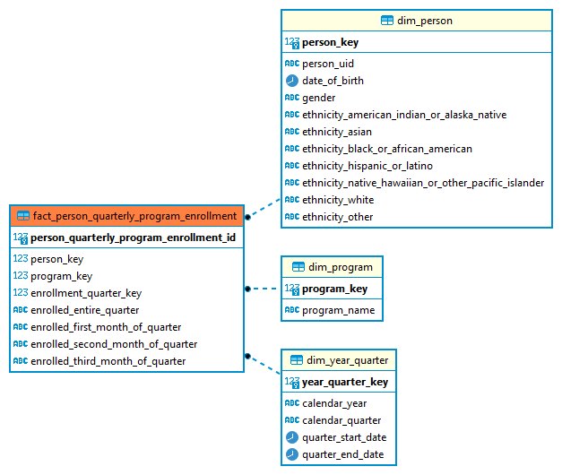
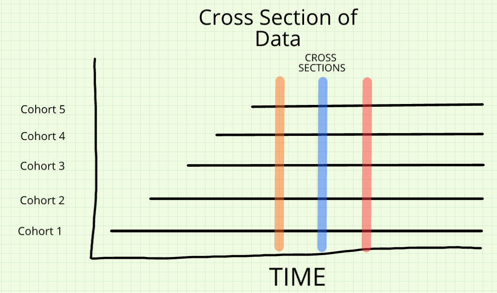

{fig-align="center"}

# Introduction
```{r setup, include=FALSE}
#HIDE THIS CHUNK FROM KNITTED OUTPUT
knitr::opts_chunk$set(include=TRUE, echo=TRUE, eval = FALSE,  warning = FALSE, fig.align = 'center')  #results=‘hide’) # needs to delete results=‘hide’
```

Welcome to the second notebook for Module 2 of this course. This notebook has two primary uses, first, we will present elements of the data model built for the class, and then will build on the data coverage and structure discussion in the exploratory data analysis notebook to a method rooted in a specific moment in time, or a **cross-sectional analysis** of two different situations. First, we will examine co-enrollment in TANF, SNAP and Wagner-Peyser, then examine a cohort of PROMIS UI claimants and their enrollment in workforce and social programs.


## What is a cross-section?
A cross-section allows us to look at a slice of our data at a specific moment in time so we can evaluate the stock of observations, just at that particular snapshot. **Through the remainder of the class notebooks, we will apply each topic to the same focused research topic, all aimed at identifying promising pathways for a specific set of TANF-enrolled individuals before COVID-imposed restrictions were enforced in the state.**

Composing a cross-section enables for broad understandings of volume and in this context, Wagner-Peyser program participant compositions. In addition, within this point in time, we can evaluate the prevalence of participation in multiple benefit programs and drill down into specific combinations. Especially from a benefit provider standpoint, it can be useful to understand common characteristics and situations of those receiving TANF benefits, regardless of benefit duration, particularly in evaluating scenarios that might lead to employment and self-sufficiency.


## Data model introduction 
A **data model** in the context of relational databases is a structured framework that defines how data are organized, related, and constrained within a database. It provides the blueprint for representing entities (such as workers, programs, or services), their attributes (like age, program type, or wages), and the relationships between them (for example, linking a worker's employment record to their participation in a workforce program). The purpose of a data model is to create a consistent, logical, and efficient way to store and query data, ensuring accuracy and interoperability across systems.

When applied to **state administrative data across multiple agencies**, a data model becomes even more critical. Different agencies-such as higher education, workforce, and human services-collect data in formats tailored to their individual missions, often using different identifiers, time frames, and definitions. A shared data model provides a standardized structure that allows these disparate datasets to be linked, compared, and analyzed in a coherent way. This enables policymakers and analysts to examine cross-agency questions (e.g., how housing insecurity affects student persistence, or how workforce training impacts employment outcomes) while maintaining privacy protections and data integrity. In short, a well-designed data model transforms fragmented administrative records into an integrated evidence base, supporting more informed decision-making and fostering sustainable partnerships among state agencies.

### Class Data Model
Our hope is that this notebook can provide a jumping off place as you begin to explore the data model, which should be the primary data source you use for the rest of your team's analysis. With that in mind, we also encourage you to examine a few of the data model tables yourselves, and to review the [**Fact Table Explainers**](P:\\tr-state-impact-ada-training\\Data documentation\\Fact_Table_Explainers.xlsx) available on the resources page of the class website. These will help provide a broader overview of the decisions rules that go into fitting the raw data you began to explore in the EDA notebook into the structure of the data model.

Don't worry if all of this data model material feels confusing - over the next several notebooks, you will see plenty of examples of how you can use the data model's tables in practice to answer questions relevant to your projects. In fact, in this notebook, we won't even dive very far into understanding the structure of the data model or its nuances. Instead, we just want to show a few simple examples that should help clarify why it's worth going through the trouble of building a data model in the first place, and how we can understand and interpret the results that the data model gives us.

::: {.callout collapse="true"}
# Technical setup

This workbook will leverage both SQL and R coding concepts, so we need to set up our environment to connect to the proper database and run R code only accessible in packages external to the basic R environment. Typically, throughout these workbooks, we use SQL for the majority of data exploration and creation of the analytic frame, and then read that analytic frame into R for the descriptive analysis and visualization.

**Note:** If you would like to view the material to establish your own environment for running the code displayed in this notebook, you can expand the following "Environment Setup" section by clicking on its heading.

::: {.panel-tabset}
## SQL Setup

For working with the database directly using SQL, the easiest way is to still copy the commands from this notebook into a script in DBeaver. As a reminder, the steps to do so are as follows:

To create a new .sql script:

1.  Open DBeaver, located on the ADRF Desktop. The icon looks like this:

    

2.  Establish your connection to the database by logging in. To do this, double-click `Redshift11_projects` on the left hand side, and it will ask for your username and password. Your username is `adrf\` followed by the name of your U: drive folder - for example, `adrf\John.Doe.T00112`. Your password is the same as the **second** password you used to log in to the ADRF - if you forgot it, you **adjust it in the ADRF management portal!**

    After you successfully establish your connection, you should see a green check next to the database name, like so:

    

3.  In the top menu bar, click **SQL Editor** then **New SQL Script**:

    

4.  To test if your connection is working, try pasting the following chunk of code into your script:

    ```{sql, eval=FALSE,  eval=FALSE}
    SELECT * 
    FROM tr_state_impact_ada_training.dim_person
    LIMIT 5
    ```

    Then run it by clicking the run button next to the script, or by pressing CTRL + Enter.

5.  You should then be able to see the query output in the box below the code.


## R Setup

#### Install Packages {.unnumbered}

Because we have left the world of the Foundations Module and entered a new workspace, we need to re-install packages that are not native to the base R environment. **We only need to do this once - this workflow for programming in R is identical to that outside the ADRF.**

::: callout-note
In the ADRF, you are limited to installing packages available on the Comprehensive R Archive Networks, commonly referred to as CRAN. CRAN is the primary centralized repository for R packages. Packages must meet certain requirements before they can become available on CRAN. Outside the ADRF, you can install packages available on other repositories, such as those accessible on Github repositories.
:::

To install a package, in the console in R studio, type the following:

```{r, eval=FALSE}
install.packages('INSERT_PACKAGE_NAME')
```

For example, to install the package `RJDBC` (for establishing our connection to the database), you should type:

```{r, eval=FALSE}
install.packages("RJDBC")
```

If you run this, you should see a set of messages in your console similar to the below:


After running this, `RJDBC` will be installed for you within your ADRF workspace. You will not need to re-install it each time you log back into the workspace.

There are two simple ways to identify if a package has already been installed in your environment:

1.  You can run `library(INSERT_PACKAGE_NAME)`, and if it returns an error like the following, it has not been installed properly:


2.  You can manually check in the bottom right pane inside R Studio by selecting the Packages tab and seeing if the package is available. Packages should be sorted alphabetically and those with a check beside them have not just already been installed, but also loaded into the environment for use:


**To install all of the packages you will need for this notebook, please run the following:**

```{r, eval=FALSE}
install.packages(RJDBC)
install.packages(tidyverse)
install.packages(dbplyr)
```

Additionally, in order to establish our database connection in R, please install the following custom package that has already been uploaded into the P: drive of this workspace:

```{r, eval=FALSE}
install.packages("P:/tr-state-impact-ada-training/r_packages/ColeridgeInitiative_0.1.2.zip")
library(ColeridgeInitiative)
```

If you are using R for the first time in this workspace, you should use the `install_new()` function to install key packages for your workflows.

```{r, eval=FALSE}
install_new()
```

**NOTE** You only have to run `install_new()` once, not each time you start Rstudio.

#### Load Libraries {.unnumbered}

After installing these packages, we next need to load them to make them available in our R environment. This is identical to the procedure we followed in the Foundations Module

```{r}
library(ColeridgeInitiative)
library(tidyverse)
library(dbplyr)
library(zoo) ## need to install
```

#### Establish Database Connection {.unnumbered}

To load data from the Redshift server into R, we need to first set up a connection to the database. The following command will prompt you for password and establish the connection:

```{r, eval=FALSE}
con <- adrf_redshift(usertype = "training")
```
:::
:::


# Data Model Elements

In the previous notebook, we covered most of the data sources available in the class, with a specific discussion of the PIRL WIOA program data. The class data model will allow us to create the "modeled data" we use for our analysis - the set of physical, easy-to-combine tables that adhere to the same rule-based framework, and does so by taking the underlying "raw" data tables and converting them into events and observations so they can be analyzed easier.

Here, we will focus on the quarterly program participation fact table, `fact_person_quarterly_program_enrollment`, located in the `tr_state_impact_ada_training` schema. As indicated by its name, this table tracks participation by quarter across the different WIOA, SNAP, and TANF programs. Since it contains participation information at consistent points in time, the table can facilitate the construction of a **cross-sectional** analytic frame. We will link this fact table, which stores the actual observations (facts) of interest, to three dimension tables:

-   Person dimension, storing information on the unique collection of persons available in the data, merging person-level attributes from a variety of sources, resulting in a "golden record" with a higher completeness than is available in individual sources
-   Time dimension, storing all possible values for a period of time (day, week, quarter, month, year) across a long period and allows for easy cross-referencing across different periods
-   Program Dimension, a reference table mapping a numeric surrogate identifier in the fact table to a more descriptive program name

The following diagram (available by selecting the "ER Diagram" after clicking on the specific table in the Database Navigator of DBeaver) visualizes the relationships between this fact table and these three dimension tables in the data model:



Let's dive a bit deeper into each of these tables first before we proceed with our cross-sectional analysis.

## Person Dimension: DIM Person

The person table, located at `tr_state_impact_ada_training.dim_person`, stores information on the characteristics of people, including date of birth, gender, and race/ethnicity. Although it has two separate individual identifiers, `person_key` and `person_uid`, `person_key` is the only one to exist in other tables in the data model. `person_key` is a simplified version of `person_uid`, which refers to the hashed SSN of the individual and can be used to link to the various raw data tables.

We can take a look at a small subset of the table:

::: panel-tabset
## SQL Query

```{sql, eval=FALSE}
SELECT *
FROM tr_state_impact_ada_training.dim_person
ORDER BY person_key
LIMIT 5
```

## `dbplyr` query

```{r}
con %>% 
  tbl(in_schema(schema = "tr_state_impact_ada_training",
                table = "dim_person")) %>%
  arrange(person_key) %>%
  head(5)
```
:::

`NULL` values refer to missing values or information not captured across the various data sources.

## Time Dimension: DIM Year Quarter

The time dimension table is located at `tr_state_impact_ada_training.dim_year_quarter` and stores information about specific time periods. The surrogate key is the `year_quarter_key`, which is a simplified version of a specific year/quarter combination. The following query shows the fields in the table:

::: panel-tabset
## SQL Query

```{sql}
SELECT *
FROM tr_state_impact_ada_training.dim_year_quarter
ORDER BY year_quarter_key
LIMIT 5
```

## `dbplyr` query

```{r}
con %>% 
  tbl(in_schema(schema = "tr_state_impact_ada_training",
                table = "dim_year_quarter")) %>%
  arrange(year_quarter_key) %>%
  head(5)
```
:::

We see here that `year_quarter_key` 0 is associated with a nonsensical date in the year 9999, which suggests this is a missing data code.

## Program Dimension: DIM Program

The program dimension table, `tr_state_impact_ada_training.dim_program`, is a reference table mapping the surrogate identifier in the fact table, `program_key`, to its longer program name. We can see the complete table with the following query:

::: panel-tabset
## SQL Query

```{sql, eval=FALSE}
SELECT *
FROM tr_state_impact_ada_training.dim_program
ORDER BY program_key
```

## `dbplyr` query

```{r}
con %>% 
  tbl(in_schema(schema = "tr_state_impact_ada_training",
                table = "dim_program")) %>%
  arrange(program_key)
```
:::

## Fact: Quarterly Enrollment by Person and Program

As mentioned above, the quarterly enrollment information by person and program is available in `tr_state_impact_ada_training.fact_person_quarterly_program_enrollment`. Each row is a unique combination of person, program, and enrollment, meaning that not only may a person in a program have potentially multiple rows in the data (one for each quarter they are enrolled), but they may also have multiple rows in a given quarter if they are enrolled in **multiple programs** at the same time. This table actually makes it very easy to examine concurrent participation across programs, as we will demonstrate later in this notebook.


::: {.callout-note}
**NOTE** The underlying data for the PIRL, stored in `ds_ar_dws.pirl_update` only has clean data for the following programs: 

- Dislocated Worker
- Wagner-Peyser
- Youth WIOA
- Adult WIOA

:::

::: panel-tabset
## SQL Query

```{sql}
SELECT *
FROM tr_state_impact_ada_training.fact_person_quarterly_program_enrollment
LIMIT 10
```

## `dbplyr` query

```{r}
con %>% 
  tbl(in_schema(schema = "tr_state_impact_ada_training",
                table = "fact_person_quarterly_program_enrollment")) %>%
  head(10)
```
:::

Note the presence of the three surrogate columns linking to each of the dimension tables: `person_key`, `program_key`, and `enrollment_year_quarter_key`. Beyond this information, the table contains indicators denoting the enrollment patterns within the quarter, as most program information is tracked at least at the monthly level.


# A motivating example: the Arkansas PIRL data

To motivate our data model, we are going to use the Arkansas PIRL data. The Arkansas PIRL (Participant Individual Record Layout) data has been provided by the Arkansas Department of Workforce Services and is our main source of information about WIOA (Workforce Innovation and Opportunity) program enrollment. The PIRL data are stored on Redshift under `ds_ar_dws.pirl_update`.

As you may have heard in class, this is a **very** large file - with over 500 variables! So, for exploration of this data, it is especially important to narrow in on the data values that are crucial to our research. Luckily, the [data documentation](P:/tr-state-impact-ada-training/Data documentation/PIRL_Layout_withAdultEd.xlsx) for PIRL is also very robust, and is available either in the ADRF or on the class website.

Let's take a quick look at the PIRL data like so:

::: {.panel-tabset .unlisted .unnumbered}
### SQL query {.unnumbered}

```{sql, eval=FALSE }
select * 
from ds_ar_dws.pirl_update
limit 5;
```

### `dbplyr` query {.unnumbered}

```{r}
con %>% 
  tbl(in_schema(schema = "ds_ar_dws",
                table = "pirl_update")) %>%
  head(n = 5) %>%
  collect() 
```
:::

Just as we might have expected (or feared!) - there are over 500 columns for each of our observation. We can also get the total number of observations like so:

::: {.panel-tabset .unlisted .unnumbered}
### SQL query {.unnumbered}

```{sql  }
select count(*) 
from ds_ar_dws.pirl_update
```

### `dbplyr` query {.unnumbered}

```{r}
con %>% 
  tbl(in_schema(schema = "ds_ar_dws",
                table = "pirl_update")) %>%
  tally() %>%
  collect()
```
:::

```{r, echo=FALSE}

nr <-con %>% 
  tbl(in_schema(schema = "ds_ar_dws",
                table = "pirl_update")) %>%
  tally() %>%
  collect()

to_millions <- function(x, digits = 1) {
  paste0(round(x / 1e6, digits), " million")
}

```


We see that there is approximately ___ records - that is a *lot* of data.

Where we start to run into problem, though, is when we think about defining a row. Recall from last week's EDA notebook that we usually want to find the distinct variable or set of variables which uniquely defines each row of the data. How can we do this for the PIRL data?

In class, we learned that, for the PIRL data:

> One row: 1 person, 1 participation spell

This seems straightforward enough. To map this onto variables in the dataset, we can look through the data dictionary. As usual, we might guess that `social_security_number` (PIRL element number 2700) defines the "1 person", while a combination of `date_of_program_entry_wioa` and `date_of_program_exit_wioa` define the spell. Let's see how many unique combinations of those variables there are:

::: {.panel-tabset .unlisted .unnumbered}
### SQL query {.unnumbered}

```{sql, eval=FALSE }
select count(
  distinct social_security_number || 
  coalesce(date_of_program_entry_wioa::text, 'null') ||
  coalesce(date_of_program_exit_wioa::text, 'null')
)
from ds_ar_dws.pirl_update
```

### `dbplyr` query {.unnumbered}

```{r}
con %>% 
  tbl(in_schema(schema = "ds_ar_dws",
                table = "pirl_update")) %>%
  select(social_security_number, date_of_program_entry_wioa, date_of_program_exit_wioa) %>%
  distinct() %>%
  tally() %>%
  collect()
```
:::

This is a much smaller number of records! We can see that there on average almost three records per unique individual-start-end combination.

Now, we could continue adding variables to our row definition and get closer and closer to uniquely defining each row. But here we have to ask ourselves - if an individual is reported to be enrolled in the same program, with the same start date, and with the same end date, how much do we really care about the other information available on the PIRL file at this point in our analysis? For example, if an individual has two rows reporting that they began WIOA Adult Program Benefits in Q2 of 2020, how much should we worry if one observation gives their birthday as 11/1/78 and another as 11/3/78? These kinds of discrepancies might be important, but perhaps not so much just for establishing our basic counts of program participants.

# A solution: using the data model

As we learned in class, one useful way to tackle this issue is through the use of a data model. Not only can a data model make record linkage much easier, it can also handle a lot of the duplication issues like we saw above, through mastering and de-duplication.

We're going to slowly introduce the main tables of our data model over the next few notebooks. In this notebook, we don't want to drive to deep into the actual usage of the data model, but instead provide some understanding for how it helps us deal with the kinds of duplication issues we saw in the PIRL data above.

## `program_participation_start_end`

There are two primary data model fact tables that we will use in this class. The first one we will look at is the `program_participation_start_end` table. As the name suggests, this table gives individual's start and end dates for participation in each of our main programs. Let's take a look at this table here:

::: {.panel-tabset .unlisted .unnumbered}
### SQL query {.unnumbered}

```{sql  }
select * 
from tr_state_impact_ada_training.fact_person_program_start_end
limit 5
```

### `dbplyr` query {.unnumbered}

```{r}
con %>% 
  tbl(in_schema(schema = "tr_state_impact_ada_training",
                table = "fact_person_program_start_end")) %>%
  head(n = 5) %>%
  collect()
```
:::

We have the following columns:

-   `person_program_start_end_id`: a unique ID for each row of the fact table
-   `person_key`: A unique person identifier that links to social security number
-   `program_key`: A unique identifier for each program (e.g. SNAP = 9, Adult WIOA = 1)
-   `entry_year_quarter_key` and `exit_year_quarter_key`: Unique identifier for the quarters the individual entered and exited the program

You might be wondering why we have all of these keys, instead of, for example, just the actual social security number, or name of the program. These keys actually, hold all the power of the dimensional model. With them, we are able to store lots and lots of observations in our main fact table very easily (numbers are quick to store), and then link those to further information in our dimension tables that actually tell us what each key corresponds to.

If that still feels confusing, then feel free to refer back to the lecture slides for the data model introduction available on the class website for a little bit more of an explanation of fact and dimension tables. But don't worry about it too much - you'll get plenty of practice using and interpreting the data model over the next few notebooks.

Turning back to the problem at hand, we can deduce that this table shows program participation at the person-program-spell level - i.e., there is one row for each unique person/program/start-date combination. This is just what we learned in class, but it's good to see it here in practice.

Let's attempt to use this table to answer a simple question: how many individuals started an Adult WIOA benefit spell in 2018 Q1. To do so is actually pretty simple with the data model - we can limit the above table to observations with `program_key = 7` (Wagner-Peyser) and `entry_year_quarter_key = 33` (2018-Q1). Remember that to determine the actual ids we wanted we needed to consult the `dim_program` and `dim_year_quarter` tables - but since this is just an example, we're not too worried about that.

Let's use these limitations now, and count the number of rows:

::: {.panel-tabset .unlisted .unnumbered}
### SQL query {.unnumbered}

```{sql, eval=FALSE }
select count(*) 
from tr_state_impact_ada_training.fact_person_program_start_end
where program_key = 7 and entry_year_quarter_key = 33
```

### `dbplyr` query {.unnumbered}

```{r}
con %>% 
  tbl(in_schema(schema = "tr_state_impact_ada_training",
                table = "fact_person_program_start_end")) %>%
  filter(program_key == 7 & entry_year_quarter_key == 33) %>%
  tally() %>%
  collect()
```
:::

We can also count the number of unique individuals, instead of the number of rows, but because our observations are already unique at the person/program/start-date level, we should get the same number. Let's verify that here:

::: {.panel-tabset .unlisted .unnumbered}
### SQL query {.unnumbered}

```{sql, eval=FALSE }
select count(distinct person_key) 
from tr_state_impact_ada_training.fact_person_program_start_end
where program_key =7 and entry_year_quarter_key = 33
```

### `dbplyr` query {.unnumbered}

```{r}
con %>% 
  tbl(in_schema(schema = "tr_state_impact_ada_training",
                table = "fact_person_program_start_end")) %>%
  filter(program_key == 7 & entry_year_quarter_key == 33 ) %>%
  select(person_key) %>% 
  distinct() %>%
  tally() %>%
  collect()
```
:::

Now, let's turn back to the PIRL data to get a better understanding of where these numbers come from. As expected, if we just count all observations in the PIRL with a program start falling in Q1 of 2018 we get a much larger number:

::: {.panel-tabset .unlisted .unnumbered}
### SQL query {.unnumbered}

```{sql  }
select count(distinct(social_security_number)) 
from ds_ar_dws.pirl_update
where 
  wagner_peyser_employment_service_wioa != 0 and 
  date_of_program_entry_wioa >= '2018-01-01' and 
  date_of_program_entry_wioa <= '2018-03-31' and
  sheetnameproperty = 'Wagner-Peyser'
```

### `dbplyr` query {.unnumbered}

```{r}
con %>% 
  tbl(in_schema(schema = "ds_ar_dws",
                table = "pirl_update")) %>%
  filter(
    wagner_peyser_employment_service_wioa != 0,
    date_of_program_entry_wioa >= as.Date("2018-01-01"),
    date_of_program_entry_wioa <= as.Date("2018-03-31"),
    sheetnameproperty == "Wagner-Peyser"
  ) %>%
  summarise(
    n = n_distinct(social_security_number)
  ) %>% 
  collect()
```
:::

But, again, here we're not really concerned among the variation between these duplicated rows. We just want a count of the number of individuals who started on the WIOA Adult program in this quarter. Let's therefore count only the unique social security numbers from the list above:

::: {.panel-tabset .unlisted .unnumbered}
### SQL query {.unnumbered}

```{sql, eval=FALSE }
select count(distinct social_security_number) 
from ds_ar_dws.pirl_update
where 
  wagner_peyser_employment_service_wioa in (1,2) and 
 date_of_program_entry_wioa >= '2018-01-01' and
    date_of_program_entry_wioa <= '2018-03-31' and
      sheetnameproperty = 'Wagner-Peyser'
```

### `dbplyr` query

```{r}
con %>% 
  tbl(in_schema(schema = "ds_ar_dws",
                table = "pirl_update")) %>%
  filter(
    wagner_peyser_employment_service_wioa %in% c('1', '2') & 
    date_of_program_entry_wioa >= "2018-01-01" &
    date_of_program_entry_wioa <= "2018-03-31" &
    sheetnameproperty == "Wagner-Peyser"
  ) %>%
  summarise(
    n = n_distinct(social_security_number)
  ) %>% 
  collect()
```
:::

Now we see that the count aligns with that presented in the data model. Hopefully, this highlights what the data model is intended to do - rather than capturing all of the variation and detail separate observations contain in the underlying data table. Instead, it is helping us prepare in advance a mastered down list of individual participation spells, which can provide a starting point for understanding program enrollment.

If you did want to capture additional information from the underlying PIRL data (for example, the job center at which individuals received their services), then you might need to add additional decision rules to your analysis to handle potential issue cases where, for example, multiple jobs centers are reported for the same person-program-spell combination. Even in this case, however, the data model should still be able to provide a valuable jumping off point for getting the underlying list of program participants that you need to create that mastered data for.


# Cross-sectional data

Cross-sectional analyses allow us to examine the characteristics of people at a selected point in time, permitting us to observe patterns and differences across sub-populations. In general, though, they are limited in gaining a deep understanding of experiences over time because they consist of observations at certain points in time, rather than observations consistently over a time period.

In the figure below, we illustrate that a cross-section actually captures multiple cohorts of individuals at a single point in time, compared to a longitudinal sample, which would follow a single cohort, or multiple cohorts over time. If we take repeated cross-sections of data, we can compare the composition and characteristics of participants across those points in time. This is like comparing information from two census years. Every vertical colored line in the diagram represents a cross-sectional analysis. By developing our own cross-section, we are going to explore one of those vertical lines.

> A cohort is a defined group based on common time-based characteristics. In the diagram, you can think of each cohort as a separate group of enterers based on the date of their initial benefit reception.



A different analysis method is more appropriate for a longitudinal study, one that we will introduce in the next notebook.

## Creating a Cross-section

The specific time frame we will focus on in this notebook is the first quarter of 2018. For context, in the EDA [notebook](P:\\tr-state-impact-ada-training\\Class Notebook\\01_EDA.html#additional-data-sources), we graphed the number of observations over time for the person-level file, `ds_ar_dhs.tanf_member`. The blue area in the line plot below highlights the observations that will define our cross-section.

> Note: We are using `tanf_member` instead of `tanf_case` because our population of interest is individuals, not cases. This SQL query creates a data frame named `rows_by_month`

```{sql, eval=FALSE, output.var = "rows_by_month"}

SELECT reporting_month, COUNT(*) as n
FROM ds_ar_dhs.tanf_member
WHERE tanf = 'TRUE'
GROUP BY reporting_month
ORDER BY reporting_month
```


::: panel-tabset
## SQL Query

```{r}
rows_by_month<- con %>% 
  tbl(in_schema(schema = "ds_ar_dhs",
                table = "tanf_member")) %>%
  filter(tanf=="TRUE") %>% 
 group_by(reporting_month) %>% 
  summarize(
    num_rows = n()
  ) %>% 
  collect()
```

### `dbplyr` query
```{r}
regions <- tibble(
  x1=as.yearmon(as.character('201801'), "%Y%m"), 
  x2 = as.yearmon(as.character('201803'), "%Y%m"), 
  y1 = -Inf, 
  y2 = +Inf
)
```
:::

```{r}
rows_by_month %>%
  mutate(reformat_date = as.yearmon(as.character(reporting_month), "%Y%m")) %>%
  ggplot(aes(x = reformat_date, y = as.numeric(num_rows) )) +
  geom_rect(
    data = regions,
    inherit.aes = FALSE,
    mapping = aes(xmin = x1, xmax = x2, ymin = y1, ymax = y2),
    color = "transparent",
    fill = "blue",
    alpha = .2
  ) +
  geom_line()
```

Our cross-section comes roughly a year and a half after the peak in observations in the person-level TANF file. Looking forward, the number of rows continues to decrease over time, losing roughly half of the total number of observations by the start of the 2022 calendar year.

### Using the original data source

We can define and derive our cross-section solely from the original person-level TANF data source. Before we do so, let's remind ourselves of the basic layout of the file:

::: panel-tabset
## SQL Query

```{sql}
SELECT *
FROM ds_ar_dhs.tanf_member
LIMIT 5
```

## `dbplyr` query

```{r}
con %>% 
  tbl(in_schema(schema = "ds_ar_dhs",
                table = "tanf_member")) %>%
  head(5)
```
:::

Since the file contains observations at the `social_security_number`/`reporting_month` level, we should have enough information just using this table to define our cross-section by limiting `reporting_month`:

::: panel-tabset
## SQL Query

```{sql}
SELECT COUNT(*) as num_rows, COUNT(DISTINCT(social_security_number)) as num_ppl
FROM ds_ar_dhs.tanf_member
WHERE reporting_month in ('201801', '201802', '201803')
```

## `dbplyr` query

```{r}
con %>% 
  tbl(in_schema(schema = "ds_ar_dhs",
                table = "tanf_member")) %>%
  filter(reporting_month %in% c("201801", "201802", "201803")) %>%
  summarize(
    num_rows = n(),
    num_ppl = n_distinct(social_security_number)
  )
```
:::

For consistency with future work, where we will link observations across data sources by their hashed social security numbers, we will only consider observations with a validated hashed social security number as part of the cross-section. You may have noticed the column `valid_ssn_format`. It contains two values, either `Y` or `N`. We can add this condition to our pre-existing query:

::: panel-tabset
## SQL Query

```{sql}
SELECT COUNT(*) as num_rows, COUNT(DISTINCT(social_security_number)) as num_ppl
FROM ds_ar_dhs.tanf_member
WHERE reporting_month in ('201801', '201802', '201803') AND 
  valid_ssn_format = 'Y'
```

## `dbplyr` query

```{r}
con %>% 
  tbl(in_schema(schema = "ds_ar_dhs",
                table = "tanf_member")) %>%
  filter(
    reporting_month %in% c("201801", "201802", "201803"),
    valid_ssn_format == 'Y'
  ) %>%
  summarize(
    num_rows = n(),
    num_ppl = n_distinct(social_security_number)
  )
```
:::

Note that even though we have attempted to remove the time dimension by limiting our focus to TANF recipients in 2018Q1, since the TANF data is recorded at the monthly grain, and not quarterly, there may be some individuals appearing in the data during multiple months within the quarter. This is indicated by comparing the difference in the number of rows and unique individuals.

We can then read this into R for further analysis:

> The code in the SQL query can be run in DBeaver by pasting just the code 

::: panel-tabset
## SQL Query

```{sql, eval=FALSE}

SELECT *
FROM ds_ar_dhs.tanf_member
WHERE reporting_month in ('201801', '201802', '201803') AND
  valid_ssn_format = 'Y'
```

## `dbplyr` query

```{r}
cross_section_ods <- con %>% 
  tbl(in_schema(schema = "ds_ar_dhs",
                table = "tanf_member")) %>%
  filter(
    reporting_month %in% c("201801", "201802", "201803"),
    valid_ssn_format == 'Y'
  ) %>% 
  # bring into R 
  collect()

head(cross_section_ods)
```
:::

### Using the fact table

Since the `fact_person_quarterly_program_enrollment` table already separates out information by person, program, and quarter, our query for identifying TANF recipients in 2018Q1 only requires two inner joins to the `dim_program` and `dim_year_quarter` dimension tables:

::: panel-tabset
## SQL Query

```{sql}
SELECT COUNT(*) as num_rows, COUNT(DISTINCT(fact.person_key)) as num_ppl
FROM tr_state_impact_ada_training.fact_person_quarterly_program_enrollment fact 
--INNER JOIN WORKS BECAUSE DIM TABLES CONTAIN ALL POSSIBLE VALUES IN FACT
JOIN tr_state_impact_ada_training.dim_program dp ON (dp.program_key = fact.program_key)
JOIN tr_state_impact_ada_training.dim_year_quarter dyq ON 
  (fact.enrollment_year_quarter_key = dyq.year_quarter_key)
--WHERE IS OKAY TO USE BECAUSE AN INNER JOIN
--BE CAREFUL USING 'WHERE' WITH A LEFT OR OUTER JOIN
WHERE dp.program_name = 'Temporary Assistance for Needy Families (TANF)' AND 
  dyq.calendar_year = '2018' AND dyq.calendar_quarter = '1'
```

## `dbplyr` query

```{r}
fact <- con %>% 
  tbl(in_schema(schema = "tr_state_impact_ada_training",
                table = "fact_person_quarterly_program_enrollment"))

dp <- con %>% 
  tbl(in_schema(schema = "tr_state_impact_ada_training",
                table = "dim_program")) %>%
  filter(program_name == "Temporary Assistance for Needy Families (TANF)")

dyq <- con %>% 
  tbl(in_schema(schema = "tr_state_impact_ada_training",
                table = "dim_year_quarter")) %>%
  filter(calendar_year == '2018', calendar_quarter == '1')

fact %>%
  inner_join(dp, by = "program_key") %>%
  inner_join(dyq, by = c("enrollment_year_quarter_key" = "year_quarter_key")) %>%
  summarize(
    num_rows = n(),
    num_ppl = n_distinct(person_key)
  )
```
:::

In fact, if you compare the number of unique people retrieved in this query to that using the original data source, you will see we have the same number of people! Additionally, since the fact table stores observations quarterly, and not monthly, we only have one row per person. If you refer to the "Fact Table Explainers" guide available on the Class Resources page of the website, you will see that we adhered to the same rules in working with the `tanf_member` file that were used to populate this fact table. Let's take a look at the resulting structure of the merged table:

::: panel-tabset
## SQL Query

```{sql}
SELECT fact.*, dp.program_name, dyq.quarter_start_date, dyq.quarter_end_date
FROM tr_state_impact_ada_training.fact_person_quarterly_program_enrollment fact 
JOIN tr_state_impact_ada_training.dim_program dp ON (dp.program_key = fact.program_key)
JOIN tr_state_impact_ada_training.dim_year_quarter dyq ON 
  (fact.enrollment_year_quarter_key = dyq.year_quarter_key)
WHERE dp.program_name = 'Temporary Assistance for Needy Families (TANF)' AND 
  dyq.calendar_year = '2018' AND dyq.calendar_quarter = '1'
LIMIT 5
```

## `dbplyr` query

```{r}
fact <- con %>% 
  tbl(in_schema(schema = "tr_state_impact_ada_training",
                table = "fact_person_quarterly_program_enrollment"))

dp <- con %>% 
  tbl(in_schema(schema = "tr_state_impact_ada_training",
                table = "dim_program")) %>%
  filter(program_name == "Temporary Assistance for Needy Families (TANF)")

dyq <- con %>% 
  tbl(in_schema(schema = "tr_state_impact_ada_training",
                table = "dim_year_quarter")) %>%
  filter(calendar_year == '2018', calendar_quarter == '1') %>%
  # don't need these variables
  select(-c(calendar_year, calendar_quarter))

fact %>%
  inner_join(dp, by = "program_key") %>%
  inner_join(dyq, by = c("enrollment_year_quarter_key" = "year_quarter_key")) %>%
  head(5)
```
:::

With a join to the person dimension table, little bit of date manipulation, and logic for aggregating the different race/ethnicity columns into one larger variable, we can pull in a data frame to facilitate our next goal, evaluating the race/ethnicity and age compositions of the cross-section:

> Note: We are calculating `age` relative to the start of the quarter.

::: panel-tabset
## SQL Query

```{sql, eval=FALSE}

SELECT fact.*
, dp.program_name
, dyq.quarter_start_date
, dyq.quarter_end_date
, dper.date_of_birth
--DATEDIFF FINDS DIFFERENCE BETWEEN TWO DATES, AND REDSHIFT ROUNDS DOWN
, DATEDIFF(quarter, dper.date_of_birth, dyq.quarter_start_date)/4 as age 
, CASE
  	WHEN dper.ethnicity_american_indian_or_alaska_native = 'Yes' THEN 'AIAN' 
  	WHEN dper.ethnicity_black_or_african_american = 'Yes' THEN 'AfAm'
  	WHEN dper.ethnicity_hispanic_or_latino= 'Yes' THEN 'Hisp'
  	WHEN dper.ethnicity_asian = 'Yes' THEN 'Asian'
  	WHEN dper.ethnicity_white = 'Yes' THEN 'Wht'
  	WHEN dper.ethnicity_other ='Yes' THEN 'Other' 
  	ELSE 'Missing' 
 END AS eth_recode
FROM tr_state_impact_ada_training.fact_person_quarterly_program_enrollment fact
JOIN tr_state_impact_ada_training.dim_program dp ON (dp.program_key = fact.program_key)
JOIN tr_state_impact_ada_training.dim_year_quarter dyq 
	ON (fact.enrollment_year_quarter_key = dyq.year_quarter_key)
JOIN tr_state_impact_ada_training.dim_person dper ON (dper.person_key = fact.person_key)
WHERE dp.program_name = 'Temporary Assistance for Needy Families (TANF)' AND
  dyq.calendar_year = '2018' AND dyq.calendar_quarter = '1'
ORDER BY dper.person_key
```

## `dbplyr` query

```{r}
fact <- con %>% 
  tbl(in_schema(schema = "tr_state_impact_ada_training",
                table = "fact_person_quarterly_program_enrollment"))

dp <- con %>% 
  tbl(in_schema(schema = "tr_state_impact_ada_training",
                table = "dim_program")) %>%
  filter(program_name == "Temporary Assistance for Needy Families (TANF)")

dyq <- con %>% 
  tbl(in_schema(schema = "tr_state_impact_ada_training",
                table = "dim_year_quarter")) %>%
  filter(calendar_year == '2018', calendar_quarter == '1') %>%
  # don't need these variables
  select(-c(calendar_year, calendar_quarter))

dper <- con %>% 
  tbl(in_schema(schema = "tr_state_impact_ada_training",
                table = "dim_person")) %>%
  mutate(
    eth_recode = case_when(
      ethnicity_american_indian_or_alaska_native == 'Yes' ~ 'AIAN',
      ethnicity_black_or_african_american == 'Yes' ~ 'AfAm',
    	ethnicity_hispanic_or_latino == 'Yes' ~ 'Hisp',
    	ethnicity_asian == 'Yes' ~ 'Asian',
    	ethnicity_white == 'Yes' ~ 'Wht',
    	ethnicity_other == 'Yes' ~ 'Other', 
    	TRUE ~ 'Missing'
    )
  ) %>%
  # keep only relevant columns
  select(person_key, date_of_birth, eth_recode)

cross_section_fact <- fact %>%
  inner_join(dp, by = "program_key") %>%
  inner_join(dyq, by = c("enrollment_year_quarter_key" = "year_quarter_key")) %>%
  inner_join(dper, by = "person_key") %>%
  arrange(person_key) %>%
  # take floor to round down to integer like redshift using SQL code 
  mutate(age = floor(datediff(sql("QUARTER"), date_of_birth, quarter_start_date)/4)) %>%
  collect() 

head(cross_section_fact)
```
:::

While we could proceed with our `cross_section_ods` file, using the data model allows us to leverage the `dim_person` table containing our golden records of time invariant variables, as opposed to working with the separate TANF micro-data, which may contain some discrepancies across months for the same person. We read the results of the resulting query into R since moving forward, the methods we will apply require manipulation and visualization either not easily executable or not accessible in SQL relative to R.

## Analysis

With our cross-section identified, we can proceed with our analysis. Keep in mind that the variables we explore in the following subsections represent only a subset of possible comparison groups.

### Race/Ethnicity

We can start by looking at our combined race/ethnicity variable, `eth_recode`.

> Note: `CASE WHEN` in SQL (`case_when()` in R) will stop evaluating the row after the first `WHEN` clause to return TRUE. In the code, for example, if `ethnicity_asian` and `ethnicity_white` were both `'yes'`, the individual will be assigned an `eth_recode` value of `Asian`.

```{r}
cross_section_fact %>% 
  group_by(eth_recode) %>% 
  summarise(npersons = n_distinct( person_key )) %>% 
  # ungroup so we can take the percentage with denominator as all in next step
  ungroup() %>% 
  mutate(pct = 100 * (npersons / sum( npersons )))
```

Instead of visualizing this distribution using a common bar plot, we can opt for the more adventurous lollipop plot, which uses the `geom_point` and `geom_segment` geometries.

```{r}
cross_section_fact %>% 
  group_by(eth_recode) %>% 
  summarise(npersons = n_distinct( person_key )) %>% 
  ungroup() %>% 
  mutate(pct = 100 * (npersons / sum( npersons ))) %>% 
  ggplot(aes(y =pct,
             x=eth_recode))+
  geom_point() +
  # line should go from 0 to the percentage for each group
  geom_segment(aes(y = 0, yend = pct, x = eth_recode, xend = eth_recode)) +
  # x- and y-axes are flipped
  coord_flip() +
  labs(title = "Percentage of TANF Recipients by Race/Ethnicity",
       subtitle = "Cross-section of participants in Q1 2018")
```

We can see that the vast majority of TANF recipients in the first quarter of 2018 were categorized as either African American or White.

### Age

We can treat age as a continuous variable, visualizing the distribution using a histogram:

```{r, message=FALSE}
cross_section_fact %>%
  ggplot(aes(x=as.numeric(age))) +
  geom_histogram()
```

While this distribution plot is somewhat useful, we can get a more exact understanding of the distribution by grouping age into separate 5-year intervals:

```{r}
cross_section_fact %>% 
  # chose range greater than overall distribution to ensure all are captured
  mutate(age_group = cut(as.numeric(age), breaks = seq(0, 110, 5), include.lowest = T)) %>% 
  group_by(age_group) %>% 
  summarise(npersons = n_distinct( person_key )) %>% 
  ungroup() %>% 
  mutate(pct = 100 * (npersons / sum( npersons ))) 
```

From this we see the highest percentage of recipients in this quarter is between 25 and 30 years of age. Since we plan on eventually analyzing workforce outcomes, let's get a sense of the youngest and oldest individuals in the cross-section:

```{r}
cross_section_fact %>%
  summarize(
    youngest = min(as.numeric(age)),
    oldest = max(as.numeric(age))
  )
```

Just from an age standpoint, the cross-section seems to be satisfactory from a workforce-eligibility standpoint on the lower end. However, moving forward, we might want to add an additional condition to narrow in on only those deemed workforce-eligible.

### Concurrent Participation

Above, we developed a cross-section just focusing on TANF recipients. But what if we are interested in looking at concurrent participation across multiple programs within our cross-section of TANF recipients?

We can do so leveraging the `fact_person_quarterly_program_enrollment` table. In the following query, we restrict all potential observations those in the 2018Q1 TANF cross-section, adding additional information if they were enrolled in SNAP or Wagner-Peyser at the same time. We could expand this to include all other programs, but for the ease of interpretation, we will just focus on these programs in this example. This is where we really get to witness the power of the data model. Imagine if we had to do all of this linkage across the original SNAP and PIRL data sources!


::: {.panel-tabset .unlisted .unnumbered}
## SQL Query

```{sql, eval=FALSE}

WITH tanf AS (
  --CROSS SECTION OF 2018Q1 TANF PARTICIPANTS
	SELECT dper.person_key
	FROM tr_state_impact_ada_training.fact_person_quarterly_program_enrollment fact
  JOIN tr_state_impact_ada_training.dim_program dp ON (dp.program_key = fact.program_key)
  JOIN tr_state_impact_ada_training.dim_year_quarter dyq 
  	ON (fact.enrollment_year_quarter_key = dyq.year_quarter_key)
  JOIN tr_state_impact_ada_training.dim_person dper ON (dper.person_key = fact.person_key)
  WHERE dp.program_name = 'Temporary Assistance for Needy Families (TANF)' AND
    dyq.calendar_year = '2018' AND dyq.calendar_quarter = '1'
),
adult_snap AS (
  --CROSS SECTION OF 2018Q1 SNAP AND ADULT EDUCATION PARTICIPANTS
	SELECT dper.person_key,
	fact.program_key 
	FROM tr_state_impact_ada_training.fact_person_quarterly_program_enrollment fact
  JOIN tr_state_impact_ada_training.dim_program dp ON (dp.program_key = fact.program_key)
  JOIN tr_state_impact_ada_training.dim_year_quarter dyq 
  	ON (fact.enrollment_year_quarter_key = dyq.year_quarter_key)
  JOIN tr_state_impact_ada_training.dim_person dper ON (dper.person_key = fact.person_key)
	WHERE dp.program_name IN ('Supplemental Nutrition Assistance Program (SNAP)', 'Wagner-Peyser Employment Service (WIOA)') AND 
	dyq.calendar_year = '2018' AND dyq.calendar_quarter = '1'
)
SELECT tanf.*, adult_snap.program_key 
FROM tanf 
--LEFT JOIN KEEPS EVERYONE FROM TANF. IF THEY DON'T JOIN THEY HAVE NA PROGRAM_KEY
LEFT JOIN adult_snap 
  ON (tanf.person_key = adult_snap.person_key)
ORDER BY tanf.person_key, program_key

```

## `dbplyr` query

```{r}
fact <- con %>% 
  tbl(in_schema(schema = "tr_state_impact_ada_training",
                table = "fact_person_quarterly_program_enrollment"))

dp <- con %>% 
  tbl(in_schema(schema = "tr_state_impact_ada_training",
                table = "dim_program")) %>%
  filter(program_name == "Temporary Assistance for Needy Families (TANF)")

dyq <- con %>% 
  tbl(in_schema(schema = "tr_state_impact_ada_training",
                table = "dim_year_quarter")) %>%
  filter(calendar_year == '2018', calendar_quarter == '1') %>%
  # don't need these variables
  select(-c(calendar_year, calendar_quarter))

dper <- con %>% 
  tbl(in_schema(schema = "tr_state_impact_ada_training",
                table = "dim_person"))

# cross-section of 2018Q1 tanf participants
tanf <- fact %>%
  inner_join(dp, by = "program_key") %>%
  inner_join(dyq, by = c("enrollment_year_quarter_key" = "year_quarter_key")) %>%
  inner_join(dper, by = "person_key") %>%
  select(person_key)

dp_as <- con %>% 
  tbl(in_schema(schema = "tr_state_impact_ada_training",
                table = "dim_program")) %>%
  filter(program_name %in% c( "Wagner-Peyser Employment Service (WIOA)", 'Supplemental Nutrition Assistance Program (SNAP)'))

# cross-section of 2018Q1 snap and adult education participants
wp_snap <- fact %>%
  inner_join(dp_as, by = "program_key") %>%
  inner_join(dyq, by = c("enrollment_year_quarter_key" = "year_quarter_key")) %>%
  inner_join(dper, by = "person_key") %>%
  select(person_key, program_key)

co_xsection <- tanf %>%
  # left_join keeps everyone from tanf. if they don't join they have NA program_key
  left_join(wp_snap, by = "person_key") %>%
  arrange(person_key, program_key) %>%
  collect()

head(co_xsection)
```
:::

We can confirm that our join worked as intended by comparing the number of unique `person_key` values in `co_xsection` to that of `cross_section_fact`.

```{r}
co_xsection %>%
  summarize(
    n_rows = n(), 
    n_people = n_distinct(person_key)
  )
```

We can see that we have the same number of people as before, which aligns with the logic of our left join. Additionally, we see that we do not have exactly one row per person - and that is okay! We may have multiple rows per `person_key` if the individual is concurrently participating in all three programs in 2018Q1. In fact, the structure of `co_xsection` may not be as clear as we would like, but it does adhere to the rules of the joining mechanism. Let's take a look at the possible values of `program_key`:

```{r}
co_xsection %>%
  distinct(program_key)
```

Given that TANF corresponds to `program_key = 10`, it may be surprising to see that there are not any observations with this value. But again, this is due to the nature of the join - every individual in `co_xsection` is enrolled in TANF! This means that if they have a NULL `program_key` value, the individual only received TANF benefits in 2018Q1. Otherwise, if they have a non-null `program_key`, then in addition to receiving TANF benefits, they also participated in a separate benefit program.

With some manipulation, we can aggregate this table to categorize the nature of concurrent participation, or lack thereof:

```{r}
# identify those in all three programs
# will have two rows in data frame
all_three <- co_xsection %>%
  group_by(person_key) %>%
  summarize(
    n = n()
  ) %>%
  filter(n > 1) %>%
  ungroup()

# of all either in just TANF or TANF + either SNAP or Wagner Peyser
not_three <- co_xsection %>%
  # anti_join ignores all observations in all_three
  anti_join(all_three, by = 'person_key') %>%
  group_by(program_key) %>%
  summarize(
    n = n_distinct(person_key)
  ) %>%
  ungroup() %>%
  mutate(
    program_name = case_when(
      program_key == 7 ~ "TANF + WP",
      program_key == 9 ~ "TANF + SNAP",
      is.na(program_key) ~ "TANF",
      TRUE ~ "missing"
    )
  ) %>%
  select(-program_key)

not_three %>%
  add_row(
    # each person is a row in all_three
    n = nrow(all_three), 
    program_name = "TANF + WP + SNAP"
  ) %>%
  mutate(perc = 100*n/sum(n)) %>%
  arrange(desc(perc)) %>%
  # rearrange columns to bring program name to front
  select(program_name, everything())
```

We can visualize this output using a treemap. Unfortunately, a treemap is not a default geometry available in `ggplot2` (loaded with `library(tidyverse)`), but there are thankfully other libraries available in R to create them. We use a separate `treemapify` package that integrates with the overall `ggplot2` framework. 

```{r}
#load treemapify package
library(treemapify)

not_three <-not_three %>%
  add_row(
    # each person is a row in all_three
    n = nrow(all_three), 
    program_name = "TANF + WP + SNAP"
  )

  ggplot(not_three,aes(area = n, fill =program_name, label = program_name)) +
  geom_treemap() + 
  geom_treemap_text(fontface = "italic", colour = "white", place = "centre",
                    grow = TRUE)+
    labs(title = "Proportion Co Enrolled" )
  
```

Interesting! Between the output table and treemap, we can see that the majority of individuals receiving TANF benefits in 2018Q1 were also participating in SNAP at the same time as well.

# Creating a cross sectional file for our analytic frame
::: {.callout collapse="true"}

## Background on our population
Our example in the class focuses on outcomes for job-seekers in the UI claims file (`ds_ar_dws.promis`), so we will select all individuals in the PROMIS UI file in the first quarter of 2018 (`year_quarter_key = 33`). We then link to the person dimension table to collect some demographic variables. Next, we use the `LISTAGG` SQL function to find all the program codes that the person is enrolled in in this quarter, and put them in a comma separated list. This probably isn't ideal, but since most people aren't co-enrolled in more that a few programs, it is workable.  Next we joing these files together and recode the `co_enrolled` variable to create a categorical variable of the various programs a person is enrolled in.

This data file will give us the enrollment information and some key demographic variables we can use for analysis. 

::: {.panel-tabset .unlisted .unnumbered}

### SQL Query

```{sql, eval=FALSE}
 
with base as(
select p.ssn,
dp.gender,
p.education,
dp.person_key , 
DATEDIFF(quarter, dp.date_of_birth, dyq.quarter_start_date)/4 as age ,
CASE
    WHEN dp.ethnicity_american_indian_or_alaska_native = 'Yes' THEN 'AIAN' 
    WHEN dp.ethnicity_black_or_african_american = 'Yes' THEN 'AfAm'
    WHEN dp.ethnicity_hispanic_or_latino= 'Yes' THEN 'Hisp'
    WHEN dp.ethnicity_asian = 'Yes' THEN 'Asian'
    WHEN dp.ethnicity_white = 'Yes' THEN 'Wht'
    WHEN dp.ethnicity_other ='Yes' THEN 'Other' 
    ELSE 'Missing' 
     END AS eth_recode
from ds_ar_dws.promis p 
left join tr_state_impact_ada_training.dim_person dp 
 	on p.ssn = dp.person_uid 
 	left join tr_state_impact_ada_training.dim_year_quarter dyq 
 	on TO_DATE(p.week_ending_date, 'YYYYMMDD') between dyq.quarter_start_date and dyq.quarter_end_date 
 	where dyq.year_quarter_key in (33)
group by 1,2,3,4,5,6  --deduplicate
order by 1,2,3,4,5,6
),
wp AS (
    SELECT
        fppse.person_key,
        LISTAGG(fppse.program_key, ', ') WITHIN GROUP (ORDER BY fppse.program_key) AS program_keys,
        fppse.entry_year_quarter_key,
        fppse.exit_year_quarter_key
    FROM tr_state_impact_ada_training.fact_person_program_start_end fppse
    WHERE fppse.entry_year_quarter_key IN (33)
    GROUP BY fppse.person_key, fppse.entry_year_quarter_key, fppse.exit_year_quarter_key
)
SELECT 
    base.*,
    wp.program_keys,   -- now one column with "1, 2" etc
    wp.entry_year_quarter_key,
    wp.exit_year_quarter_key,
    CASE 
        WHEN wp.program_keys is null then 'not-enrolled'
        when wp.program_keys = '7' then 'wp only'
        when wp.program_keys = '9' then 'snap only'
        when wp.program_keys = '10' then 'tanf only'
        when wp.program_keys = '2' then 'dw wioa only'
        when wp.program_keys = '2, 7' then 'dw and wp'
        when wp.program_keys = '7, 9' then 'snap and wp'
        when wp.program_keys = '1' then 'adult wioa'
        when wp.program_keys = '1, 7' then 'adult wioa and WP'
        when wp.program_keys = '1, 9' then 'adult wioa and snap'
        when wp.program_keys = '3' then 'youth wioa'
        when wp.program_keys = '3, 7' then 'youth wioa and wp'
        when wp.program_keys = '7, 10' then 'wp and tanf'
        when wp.program_keys = '7, 12' then 'wp and adult education'
        when wp.program_keys = '9, 12' then 'snap and adult education'
        else null 
        end as co_enrolled
FROM base
LEFT JOIN wp
    ON base.person_key = wp.person_key
ORDER BY base.person_key, wp.entry_year_quarter_key;
```

### `dbplyr` query
```{r}
library(lubridate)
# reference tables
promis <- tbl(con, in_schema("ds_ar_dws", "promis"))
dim_person <- tbl(con, in_schema("tr_state_impact_ada_training", "dim_person"))
dim_year_quarter <- tbl(con, in_schema("tr_state_impact_ada_training", "dim_year_quarter"))
fact_program <- tbl(con, in_schema("tr_state_impact_ada_training", "fact_person_program_start_end"))

# base CTE
promis2 <- promis %>%
  mutate(week_ending_date_sql = sql("TO_DATE(week_ending_date, 'YYYYMMDD')")) %>% 
  select(ssn, education, week_ending_date_sql)

# base CTE
base <- promis2 %>%
  left_join(dim_person, by = c("ssn" = "person_uid")) %>%
  left_join(
    dim_year_quarter,
    by = join_by(
      between(week_ending_date_sql, quarter_start_date, quarter_end_date)
    )
  ) %>%
  filter(year_quarter_key %in% 33) %>%
  mutate(
    age = sql("DATEDIFF(quarter, date_of_birth, quarter_start_date)/4"),
    eth_recode = case_when(
      ethnicity_american_indian_or_alaska_native == "Yes" ~ "AIAN",
      ethnicity_black_or_african_american == "Yes" ~ "AfAm",
      ethnicity_hispanic_or_latino == "Yes" ~ "Hisp",
      ethnicity_asian == "Yes" ~ "Asian",
      ethnicity_white == "Yes" ~ "Wht",
      ethnicity_other == "Yes" ~ "Other",
      TRUE ~ "Missing"
    )
  ) %>%
  select(ssn, gender, education, person_key, age, eth_recode) %>%
  distinct()

# wp CTE
wp <- fact_program %>%
  filter(entry_year_quarter_key %in% 33) %>%
  group_by(person_key, entry_year_quarter_key, exit_year_quarter_key) %>%
  summarise(
    program_keys = sql("LISTAGG(program_key, ', ') WITHIN GROUP (ORDER BY program_key)")
  )

# final query
final <- base %>%
  left_join(wp, by = "person_key") %>%
  mutate(
    co_enrolled = case_when(
    is.na(program_keys) ~ "not-enrolled",
    program_keys == "7" ~ "wp only",
    program_keys == "9" ~ "snap only",
    program_keys == "10" ~ "tanf only",
    program_keys == "2" ~ "dw wioa only",
    program_keys == "2, 7" ~ "dw and wp",
    program_keys == "7, 9" ~ "snap and wp",
    program_keys == "1" ~ "adult wioa",
    program_keys == "1, 7" ~ "adult wioa and wp",
    program_keys == "1, 9" ~ "adult wioa and snap",
    program_keys == "3" ~ "youth wioa",
    program_keys == "3, 7" ~ "youth wioa and wp",
    program_keys == "7, 10" ~ "wp and tanf",
    program_keys == "7, 12" ~ "wp and adult education",
    program_keys == "9, 12" ~ "snap and adult education",
    TRUE ~ NA_character_
  )
  ) %>%
  arrange(person_key, entry_year_quarter_key) %>% 
  collect()

head(final, n = 50)

```
:::


## Analysis of demographic characteristics of program enrollees

```{r}
final %>% 
  filter(gender !="") %>% 
  group_by(co_enrolled, gender ) %>% 
  tally() %>% 
  #ungroup() %>% 
  mutate(pct = n/sum(n)) %>% 
  ungroup() %>% 
  arrange(co_enrolled, gender) %>% 
  ggplot(aes(y = pct, x = gender, group=co_enrolled, fill=co_enrolled))+
  geom_col(position = "dodge")+
  theme_minimal()

```
```{r}
final %>% 
  filter(gender !="") %>% 
  ggplot(aes( x =as.numeric(age), fill=gender))+ 
  geom_histogram(position = "dodge", bins = 20, color = "black")+
  theme_minimal()
```


:::


# Next Steps: Applying the notebook to your project

This workbook applies the concepts of a cross-sectional analysis to the Arkansas data and covers some of the considerations and potential of such a investigation. Through the motivation of building a cross-sectional analytic frame, we leveraged a relatively new facet of the data model, a fact table covering quarterly program participation. We also showed how you can apply the same decision rules populating the data model to the original data source. Beyond limiting a cross-section to a singular program, we demonstrated the full power of the data model structure in using this fact table to identify concurrent participation in related programs. If you want to apply a different set of decision rules to identify a cross-section that are not consistent with the data model, you can still use the model by limiting observations to just those satisfying your team's constraints.

In upcoming notebooks, we will expand the scope of the information covered and focus on carrying out a longitudinal analysis. Even if your team's ultimate plan expands beyond it, a cross-sectional approach may be useful. If your team deems it appropriate to develop a cross-section or use the quarterly program participation fact table, you are encouraged to re-purpose as much code as possible in developing your initial snapshot and subsequent descriptive analysis. As you work through your project, remember to add your thoughts and findings to your team's project template in the ADRF.

# Citations

McGough, R., Mainali, N., Feder, B., & Edelmann, J. (2023, December 19). Linked Dataset Construction for Longitudinal Analysis of Arkansas RAPIDS and UI Wage Records. Zenodo. https://doi.org/10.5281/zenodo.10407416


Wisconsin Applied Data Analytics Training Program - Notebook 1B: Cross-Sectional Analysis (citation to be updated)
