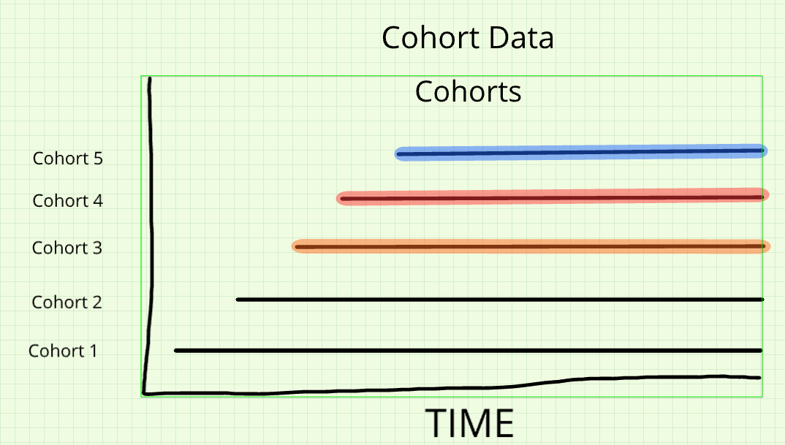
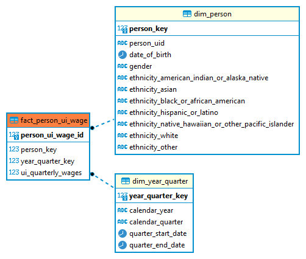

{fig-align="center"}

# Introduction
```{r setup, include=FALSE}
#HIDE THIS CHUNK FROM KNITTED OUTPUT
knitr::opts_chunk$set(include=TRUE, echo=TRUE, eval = FALSE,  warning = FALSE, fig.align = 'center')  #results=‘hide’) # needs to delete results=‘hide’
```

Welcome to the third notebook of Module 2, where will expand our focus to a framework that facilitates longitudinal investigations, a **cohort analysis**. In doing so, we will reintroduce a fact table initially discussed in the second notebook that tracks individuals at the program level by their spells, or episodes of service. Here, we will develop a cohort analysis to help address our same focused research topic introduced in the previous notebook, which is aimed at identifying participants who had filed a UI claim in a specified quarter, then following them into their future workforce outcomes.

Previously, we applied a cross-sectional analysis to the TANF and WIOA data, which allowed us to better understand the volume of individuals enrolled in multiple programs at a specific moment in time. Since cross-sections are restricted to particular snapshots, and do not account for shocks though, they are limited in providing a framework for tracking experiences over time. Contrast this approach to that of a cohort analysis.

In creating a cohort, we will denote a reference point where each member of our cohort experienced a common event - this could be entry into a program, exit from a program, or any other shared experience across a set of observations. With this setup, we can better understand and compare the experiences of those encountering the same policies and economic shocks at the same time, especially across different subgroups, or even cohorts.

# Cohort Construction

Composing a cohort enables us to understanding the outcomes and behaviors of a particular group of participants who are identified by their shared experience of some event at a defined time period. From this cohort, we can then measure prevalence of participation in programs and patterns of co-enrollment over time, as well as foundational outcomes related to specific program evaluation criteria.

Cohort analyses in general allow for a deep understanding of experiences over time, because they consist of observations of a focal group of people potentially measured at multiple points in time, rather than observations at an arbitrary point in time like a cross-sectional data set does.

In the figure below, we illustrate multiple cohorts, identified by the different colors, over time. The value of looking at a cohort of individuals is that we can tie variation in later program participation or outcomes to events that occur earlier in the lives of this group. The diagram below is a visual representation of multiple cohorts. You can contrast this with the [diagram](P:/tr-state-impact-ada-training/Class%20Notebooks/02_datamodel_cross_section.html#cross-sectional-data) in the previous notebook displaying colored vertical lines representing cross-sections, potentially including multiple cohorts in each view. In this notebook, we are going to explore both constructing a cohort and as one of these horizontal lines.



In total, there are three main steps in carrying out an effective cohort analysis:

1.  Defining your cohort - selecting the decision rules to subset the data to your cohort of interest
2.  Record linkage - adding additional datasets to your base cohort to build your full cohort analytic frame with all necessary information for your analysis
3.  Measurement creation - identifying and developing outcomes for your study

This notebook is primarily concerned with taking the core data file defined in the previous notebook and linking this group of individuals to the wage fact table `tr_state_impact_ada_training.fact_person_ui_wage`


## The Purpose of these Notebooks

You will now have the opportunity to apply the skills covered in both modules thus far to restricted use Arkansas data. With your team, you will carry out a detailed analysis of this data and prepare a final project showcasing your results.

These workbooks are here to help you along in this project development by showcasing how to apply the techniques discussed in class to the Arkansas data. Part of this notebook will be technical - providing basic code snippets your team can **modify** to begin parsing through the data. As always, however, there will also be an applied data literacy component of these workbooks, and it should help you develop a better understanding of the structure and use of the underlying data even if you never wrote a line of code.

The timeline for completing these workbooks will be provided on the training website and communicated to you in class.

::: {.callout collapse="true"}
# Technical setup

This workbook will leverage both SQL and R coding concepts, so we need to set up our environment to connect to the proper database and run R code only accessible in packages external to the basic R environment. Typically, throughout these workbooks, we use SQL for the majority of data exploration and creation of the analytic frame, and then read that analytic frame into R for the descriptive analysis and visualization.

**Note:** If you would like to view the material to establish your own environment for running the code displayed in this notebook, you can expand the following "Environment Setup" section by clicking on its heading.

::: {.panel-tabset}
## SQL Setup

For working with the database directly using SQL, the easiest way is to still copy the commands from this notebook into a script in DBeaver. As a reminder, the steps to do so are as follows:

To create a new .sql script:

1.  Open DBeaver, located on the ADRF Desktop. The icon looks like this:

    

2.  Establish your connection to the database by logging in. To do this, double-click `Redshift11_projects` on the left hand side, and it will ask for your username and password. Your username is `adrf\` followed by the name of your U: drive folder - for example, `adrf\John.Doe.T00112`. Your password is the same as the **second** password you used to log in to the ADRF - if you forgot it, you **adjust it in the ADRF management portal!**

    After you successfully establish your connection, you should see a green check next to the database name, like so:

    

3.  In the top menu bar, click **SQL Editor** then **New SQL Script**:

    

4.  To test if your connection is working, try pasting the following chunk of code into your script:

    ```{sql, eval=FALSE,  eval=FALSE}
    SELECT * 
    FROM tr_state_impact_ada_training.dim_person
    LIMIT 5
    ```

    Then run it by clicking the run button next to the script, or by pressing CTRL + Enter.

5.  You should then be able to see the query output in the box below the code.


## R Setup

#### Install Packages {.unnumbered}

Because we have left the world of the Foundations Module and entered a new workspace, we need to re-install packages that are not native to the base R environment. **We only need to do this once - this workflow for programming in R is identical to that outside the ADRF.**

::: callout-note
In the ADRF, you are limited to installing packages available on the Comprehensive R Archive Networks, commonly referred to as CRAN. CRAN is the primary centralized repository for R packages. Packages must meet certain requirements before they can become available on CRAN. Outside the ADRF, you can install packages available on other repositories, such as those accessible on Github repositories.
:::

To install a package, in the console in R studio, type the following:

```{r, eval=FALSE}
install.packages('INSERT_PACKAGE_NAME')
```

For example, to install the package `RJDBC` (for establishing our connection to the database), you should type:

```{r, eval=FALSE}
install.packages("RJDBC")
```

If you run this, you should see a set of messages in your console similar to the below:


After running this, `RJDBC` will be installed for you within your ADRF workspace. You will not need to re-install it each time you log back into the workspace.

There are two simple ways to identify if a package has already been installed in your environment:

1.  You can run `library(INSERT_PACKAGE_NAME)`, and if it returns an error like the following, it has not been installed properly:


2.  You can manually check in the bottom right pane inside R Studio by selecting the Packages tab and seeing if the package is available. Packages should be sorted alphabetically and those with a check beside them have not just already been installed, but also loaded into the environment for use:


**To install all of the packages you will need for this notebook, please run the following:**

```{r, eval=FALSE}
install.packages("RJDBC")
install.packages("tidyverse")
install.packages("dbplyr")
```

Additionally, in order to establish our database connection in R, please install the following custom package that has already been uploaded into the P: drive of this workspace:

```{r, eval=FALSE}
install.packages("P:/tr-state-impact-ada-training/r_packages/ColeridgeInitiative_0.1.2.zip")
library(ColeridgeInitiative)
```

If you are using R for the first time in this workspace, you should use the `install_new()` function to install key packages for your workflows.

```{r, eval=FALSE}
install_new()
```

**NOTE** You only have to run `install_new()` once, not each time you start Rstudio.

#### Load Libraries {.unnumbered}

After installing these packages, we next need to load them to make them available in our R environment. This is identical to the procedure we followed in the Foundations Module

```{r}
library(ColeridgeInitiative)
library(tidyverse)
library(dbplyr)
library(zoo) ## need to install
```

#### Establish Database Connection {.unnumbered}

To load data from the Redshift server into R, we need to first set up a connection to the database. The following command will prompt you for password and establish the connection:

```{r, eval=FALSE}

options(java.parameters = c("-XX:+UseConcMarkSweepGC", "-Xmx16000m"))
gc()

con <- adrf_redshift(usertype = "training")
```
:::
:::


# Data Model: Workforce Records

Until now, we have not encountered any tables in the dimensional data model containing references to workforce experiences. Thankfully, we will introduce our final fact table within the data model, `fact_person_ui_wage` also located in the `tr_state_impact_ada_training` schema, which captures wages reported for each person in each quarter they are employed. This fact table was created directly from Arkansas' UI wage records, aggregating person/employer/quarter data to a person/quarter combination. While the UI wage records are not a perfect population of everyone employed in Arkansas, it does capture roughly 95 percent of private non-farm wage and salary employment in the state. A refresher of the raw UI wage data is available in the [first class notebook](P:/tr-enrollment-to-employment/ETA%20Class%201/Notebooks/01_EDA.html#arkansas-ui-wage-data-ds_ar_dws.ui_wages_lehd).

The `tr_state_impact_ada_training.fact_person_ui_wage` table contains identical identifiers as the other program-focused fact tables. This will make it easy to link this to our cohort, which was initially built on the raw TANF data and then linked to the program fact tables. As visualized in the diagram below (again available by selecting the "ER Diagram" option after clicking on the specific table in the Database Navigator of DBeaver), this fact table links to two of the three dimension tables leveraged in previous notebooks:

-   Person dimension, storing information on the unique collection of persons available in the data, merging person-level attributes from a variety of sources, resulting in a "golden record" with a higher completeness than is available in individual sources
-   Time dimension, storing all possible values for a period of time (day, week, quarter, month, year) across a long period and allows for easy cross-referencing across different periods

You may notice the lack of `program_key` identifier to link to the `dim_program` table - this is by design, as this fact table does not contain any information on program participation.



We can see a subset of this table and confirm that data is recorded at the person/quarter level with the following query:

::: panel-tabset
## SQL Query

```{sql, eval=FALSE}
SELECT *
FROM tr_state_impact_ada_training.fact_person_ui_wage 
order by person_key, year_quarter_key
LIMIT 50
```

## `dbplyr` query

```{r}
con %>% 
  tbl(in_schema(schema = "tr_state_impact_ada_training",
                table = "fact_person_ui_wage")) %>%
  arrange(person_key, year_quarter_key) %>% 
  head(50)
```
:::

Additionally, we can validate the presence of the surrogate columns linking to two of our dimension tables: `person_key` and `year_quarter_key`. Beyond this information, the table just contains a unique row identifier for the table, `person_ui_wage_id`, which does not link to any other table in a meaningful fashion.

# Linking Cohort to Workforce Fact Table

Before we can begin to build out the aforementioned employment outcomes for our cohort, we need to link our cohort to this new fact table. Recall the structure and contents of our cohort table, which we saved in the `tr_state_impact_ada_training` schema as `nb_cohort`:

::: panel-tabset
## SQL Query

```{sql, eval=FALSE}
SELECT *
FROM tr_state_impact_ada_training.nb_cohort
LIMIT 5
```

## `dbplyr` query

```{r}
con %>% 
  tbl(in_schema(schema = "tr_state_impact_ada_training",
                table = "nb_cohort")) %>%
  head(5)
```
:::

Since we have already linked the original TANF data to the data model in developing our cohort, we have variables such as `person_key` and `exit_year_quarter_key`, which we can use to link directly to our workforce fact table. Since the workforce fact table only contains quarterly observations for those present in the UI wage records, we must use a **left join** if we want to preserve observations for individuals in our cohort who were never present in the UI wage records. Additionally, while we can look at workforce experiences over the entire range of available wage records, we will take a more limited view by only bringing in employment records within 5 quarters of exit. We will read this resulting table into R for future use:


# Creating an analytic file for our class example
::: {.callout collapse="true"}

## Background on our population
Our example in the class focuses on outcomes for job-seekers in the UI claims file (`ds_ar_dws.promis`), so we will select all individuals in the PROMIS UI file in the first quarter of 2018 (`year_quarter_key = 33`).

We then link to the person dimension table to collect some demographic variables.

Next, we use the `LISTAGG` SQL function to find all the program codes that the person is enrolled in in this quarter, and put them in a comma separated list. This probably isn't ideal, but since most people aren't co-enrolled in more that a few programs, it is workable. 

Next we join these files together and recode the `co_enrolled` variable to create a categorical variable of the various programs a person is enrolled in.

This data file will give us the enrollment information and some key demographic variables we can use for analysis. 

::: {.panel-tabset .unlisted .unnumbered}

### SQL Query

```{sql, eval=FALSE}
 
with base as(
select p.ssn,
dp.gender,
p.education,
dp.person_key , 
DATEDIFF(quarter, dp.date_of_birth, dyq.quarter_start_date)/4 as age ,
CASE
    WHEN dp.ethnicity_american_indian_or_alaska_native = 'Yes' THEN 'AIAN' 
    WHEN dp.ethnicity_black_or_african_american = 'Yes' THEN 'AfAm'
    WHEN dp.ethnicity_hispanic_or_latino= 'Yes' THEN 'Hisp'
    WHEN dp.ethnicity_asian = 'Yes' THEN 'Asian'
    WHEN dp.ethnicity_white = 'Yes' THEN 'Wht'
    WHEN dp.ethnicity_other ='Yes' THEN 'Other' 
    ELSE 'Missing' 
     END AS eth_recode
from ds_ar_dws.promis p 
left join tr_state_impact_ada_training.dim_person dp 
 	on p.ssn = dp.person_uid 
 	left join tr_state_impact_ada_training.dim_year_quarter dyq 
 	on TO_DATE(p.week_ending_date, 'YYYYMMDD') between dyq.quarter_start_date and dyq.quarter_end_date 
 	where dyq.year_quarter_key in (33)
 	and dp.date_of_birth != '1900-01-01'
 	--and dp.person_key = 211
group by 1,2,3,4,5,6  --deduplicate
order by 1,2,3,4,5,6
),
wp AS (
    SELECT
        fppse.person_key,
        LISTAGG(fppse.program_key, ', ') WITHIN GROUP (ORDER BY fppse.program_key) AS program_keys,
        fppse.entry_year_quarter_key
    FROM tr_state_impact_ada_training.fact_person_program_start_end fppse
    WHERE fppse.entry_year_quarter_key IN (33)
    GROUP BY fppse.person_key, fppse.entry_year_quarter_key
),
joined as(
SELECT 
    base.person_key,
    base.gender,
    base.education, 
    base.age,
    base.eth_recode,
    --wp.program_keys,   -- now one column with "1, 2" etc
    wp.entry_year_quarter_key,
    --wp.exit_year_quarter_key,
    CASE 
        WHEN wp.program_keys is null then 'not-enrolled'
        when wp.program_keys = '7' then 'wp only'
        when wp.program_keys = '9' then 'snap only'
        when wp.program_keys = '10' then 'tanf only'
        when wp.program_keys = '2' then 'dw wioa only'
        when wp.program_keys = '2, 7' then 'dw and wp'
        when wp.program_keys = '7, 9' then 'snap and wp'
        when wp.program_keys = '1' then 'adult wioa'
        when wp.program_keys = '1, 7' then 'adult wioa and WP'
        when wp.program_keys = '1, 9' then 'adult wioa and snap'
        when wp.program_keys = '3' then 'youth wioa'
        when wp.program_keys = '3, 7' then 'youth wioa and wp'
        when wp.program_keys = '7, 10' then 'wp and tanf'
        when wp.program_keys = '7, 12' then 'wp and adult education'
        when wp.program_keys = '9, 12' then 'snap and adult education'
        else null 
        end as co_enrolled
FROM base
LEFT JOIN wp
    ON base.person_key = wp.person_key
ORDER BY base.person_key, wp.entry_year_quarter_key
)
select joined.person_key,
joined.co_enrolled,
joined.gender,
   joined.education, 
   joined.age,
   joined.eth_recode,
ui.year_quarter_key,
ui.ui_quarterly_wages
from joined
left join tr_state_impact_ada_training.fact_person_ui_wage ui
    on joined.person_key = ui.person_key and ui.year_quarter_key > 33 or ui.ui_quarterly_wages is null
order by joined.person_key, ui.year_quarter_key

```

### `dbplyr` query
```{r}
library(lubridate)

# Source tables
promis <- tbl(con, in_schema("ds_ar_dws", "promis"))
dim_person <- tbl(con, in_schema("tr_state_impact_ada_training", "dim_person"))
dim_year_quarter <- tbl(con, in_schema("tr_state_impact_ada_training", "dim_year_quarter"))
fact_program <- tbl(con, in_schema("tr_state_impact_ada_training", "fact_person_program_start_end"))
ui_wage <- tbl(con, in_schema("tr_state_impact_ada_training", "fact_person_ui_wage"))

# Pre-compute date
promis2 <- promis %>%
  mutate(week_ending_date_sql = sql("TO_DATE(week_ending_date, 'YYYYMMDD')")) %>% 
  select(week_ending_date_sql, ssn,education )

# ---- BASE ----
base <- promis2 %>%
  left_join(dim_person, by = c("ssn" = "person_uid")) %>%
  left_join(
    dim_year_quarter,
    by = join_by(
      between(week_ending_date_sql, quarter_start_date, quarter_end_date)
    )
  ) %>%
  filter(year_quarter_key %in% 33,
         date_of_birth != as.Date("1900-01-01")) %>%
  mutate(
    age = sql("DATEDIFF(quarter, date_of_birth, quarter_start_date)/4"),
    eth_recode = case_when(
      ethnicity_american_indian_or_alaska_native == "Yes" ~ "AIAN",
      ethnicity_black_or_african_american == "Yes" ~ "AfAm",
      ethnicity_hispanic_or_latino == "Yes" ~ "Hisp",
      ethnicity_asian == "Yes" ~ "Asian",
      ethnicity_white == "Yes" ~ "Wht",
      ethnicity_other == "Yes" ~ "Other",
      TRUE ~ "Missing"
    )
  ) %>%
  select(ssn, gender, education, person_key, age, eth_recode, year_quarter_key) %>%
  distinct()

# ---- WP ----
wp <- fact_program %>%
  filter(entry_year_quarter_key %in% 33) %>%
  group_by(person_key, entry_year_quarter_key) %>%
  summarise(
    program_keys = sql("LISTAGG(program_key, ', ') WITHIN GROUP (ORDER BY program_key)"),
    .groups = "drop"
  )

# ---- JOINED (base + wp with co_enrolled categories) ----
joined <- base %>%
  left_join(wp, by = "person_key") %>%
  mutate(
    co_enrolled = case_when(
      is.na(program_keys) ~ "not-enrolled",
      program_keys == "7" ~ "wp only",
      program_keys == "9" ~ "snap only",
      program_keys == "10" ~ "tanf only",
      program_keys == "2" ~ "dw wioa only",
      program_keys == "2, 7" ~ "dw and wp",
      program_keys == "7, 9" ~ "snap and wp",
      program_keys == "1" ~ "adult wioa",
      program_keys == "1, 7" ~ "adult wioa and wp",
      program_keys == "1, 9" ~ "adult wioa and snap",
      program_keys == "3" ~ "youth wioa",
      program_keys == "3, 7" ~ "youth wioa and wp",
      program_keys == "7, 10" ~ "wp and tanf",
      program_keys == "7, 12" ~ "wp and adult education",
      program_keys == "9, 12" ~ "snap and adult education",
      TRUE ~ NA_character_
    )
  )


# UI sub-query: only quarters > 33 (and keep just the needed cols)
ui_sub <- tbl(con, in_schema("tr_state_impact_ada_training", "fact_person_ui_wage")) %>%
  filter(year_quarter_key > 33) %>%                     # <-- the "rolling" part
  transmute(
    person_key,
    ui_year_quarter_key = year_quarter_key,             # avoid name clash
    ui_quarterly_wages
  )

# Join to your previously built 'joined' table (base + wp + co_enrolled)
final2 <- joined %>%
  left_join(ui_sub, by = "person_key") %>%              # person-level join only
  arrange(person_key, ui_year_quarter_key) %>% collect()

head(final2, n = 50)

```
:::


This table will give us the baseline data linked to wages after the quarter of program enrollment.


# Next Steps: Applying the notebook to your project

This workbook applies the concepts of a cohort analysis to the Arkansas data and covers some of the considerations and potential of such a investigation. In this notebook, we showed how you can link from a defined cohort to UI wages in the `fact_person_ui_wage` table to find wages following the time period of the cohort definition. You can apply the appropriate set of decision rules to identify the cohort for your analysis, and link to the wage outcomes in similar way.

In upcoming notebooks, we will expand the scope of the information covered and focus on carrying out a longitudinal analysis of these outcomes. As you work through your project, remember to add your thoughts and findings to your team's project template in the ADRF.
