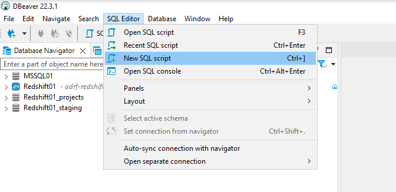
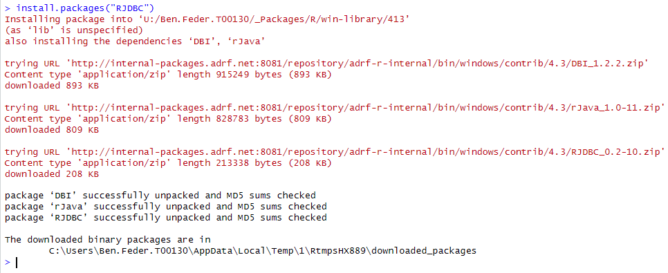
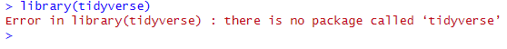
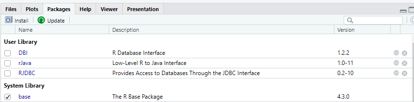

{fig-align="center"}

# Introduction
```{r setup, include=FALSE}
#HIDE THIS CHUNK FROM KNITTED OUTPUT
knitr::opts_chunk$set(include=TRUE, echo=TRUE, eval = FALSE,  warning = FALSE, fig.align = 'center')  #results=‘hide’) # needs to delete results=‘hide’
```

## Introduction to Propensity Score Analysis

Welcome to the fifth notebook of Module 2, where we introduce **propensity score analysis** as a method for estimating causal effects when random assignment is not possible. In this lesson, we will build on the regression techniques developed previously and explore how we can use propensity scores to construct comparison groups that are statistically similar to program participants. This approach helps reduce selection bias and isolate the estimated effect of program participation from pre-existing differences among individuals.

In this notebook, we will use the **propensity score** - the estimated probability of receiving treatment given a set of observed characteristics - to create a more balanced dataset for comparing treated and untreated individuals. By matching individuals with similar propensity scores, we can approximate the conditions of a randomized experiment and estimate how program participation influences outcomes such as wages or employment.  

We will begin by estimating propensity scores using a logistic regression model based on characteristics such as **age, sex, education and prior wages**. We will then use these scores to perform **nearest-neighbor matching**, pairing each treated individual with one or more nonparticipants who have similar probabilities of treatment. Finally, we will assess the quality of the matches, examine covariate balance, and estimate the **Average Treatment Effect on the Treated (ATT)** to quantify the program's impact.

### Average treatment effect on the Treated (ATT)
The Average Treatment Effect on the Treated (ATT) represents the estimated average impact of a program or intervention on those individuals who actually participated. In other words, it measures how much better (or worse) the outcomes of participants are compared to what those same individuals would have experienced had they not received the treatment - assuming all relevant confounding factors have been accounted for.

Because we cannot directly observe what would have happened to participants in the absence of the program, the ATT is estimated by comparing each treated individual's observed outcome to that of one or more matched nonparticipants with similar characteristics and similar propensity scores. By doing so, we approximate the counterfactual outcome - what the treated group's outcomes likely would have been without the treatment.

In practice, the ATT tells us the average effect of treatment among those who received it, rather than in the entire population. This distinction is important: while the Average Treatment Effect (ATE) applies to everyone, the ATT focuses on the impact experienced by program participants themselves, which is often the most relevant measure for policy evaluation and program improvement.

::: callout-note
### Key Concept
Propensity score analysis aims to reduce bias from observed differences between treated and untreated groups by matching individuals with similar probabilities of receiving treatment. This process mimics random assignment and improves causal interpretation in non-experimental settings.
:::

Previously, our regression analysis allowed us to control for multiple factors in a single model to estimate adjusted associations between program participation and outcomes. **Propensity score analysis builds on this foundation** by focusing on *balancing* the data before estimating outcomes, making the treatment and comparison groups more directly comparable. This represents a key step toward more rigorous **causal inference** in program evaluation.

::: callout-tip
### Learning Objectives
By the end of this notebook, you will be able to:
- Estimate and interpret propensity scores using logistic regression.
- Implement and assess matching methods using the `MatchIt` package.
- Evaluate covariate balance and interpret the Average Treatment Effect on the Treated (ATT).
- Understand how propensity score methods relate to regression-based approaches and how they strengthen causal inference in observational data.
:::


## The Purpose of these Notebooks

You will now have the opportunity to apply the skills covered in both modules thus far to restricted use Arkansas data. With your team, you will carry out a detailed analysis of this data and prepare a final project showcasing your results.

These workbooks are here to help you along in this project development by showcasing how to apply the techniques discussed in class to the Arkansas data. Part of this notebook will be technical - providing basic code snippets your team can **modify** to begin parsing through the data. As always, however, there will also be an applied data literacy component of these workbooks, and it should help you develop a better understanding of the structure and use of the underlying data even if you never wrote a line of code.

The timeline for completing these workbooks will be provided on the training website and communicated to you in class.

::: {.callout collapse="true"}
# Technical setup

This workbook will leverage both SQL and R coding concepts, so we need to set up our environment to connect to the proper database and run R code only accessible in packages external to the basic R environment. Typically, throughout these workbooks, we use SQL for the majority of data exploration and creation of the analytic frame, and then read that analytic frame into R for the descriptive analysis and visualization.

**Note:** If you would like to view the material to establish your own environment for running the code displayed in this notebook, you can expand the following "Environment Setup" section by clicking on its heading.

::: {.panel-tabset}
## SQL Setup

For working with the database directly using SQL, the easiest way is to still copy the commands from this notebook into a script in DBeaver. As a reminder, the steps to do so are as follows:

To create a new .sql script:

1.  Open DBeaver, located on the ADRF Desktop. The icon looks like this:

    

2.  Establish your connection to the database by logging in. To do this, double-click `Redshift11_projects` on the left hand side, and it will ask for your username and password. Your username is `adrf\` followed by the name of your U: drive folder - for example, `adrf\John.Doe.T00112`. Your password is the same as the **second** password you used to log in to the ADRF - if you forgot it, you **adjust it in the ADRF management portal!**

    After you successfully establish your connection, you should see a green check next to the database name, like so:

    

3.  In the top menu bar, click **SQL Editor** then **New SQL Script**:

    

4.  To test if your connection is working, try pasting the following chunk of code into your script:
```{sql, eval=FALSE,  eval=FALSE}
    SELECT * 
    FROM tr_state_impact_ada_training.dim_person
    LIMIT 5
```

    Then run it by clicking the run button next to the script, or by pressing CTRL + Enter.

5.  You should then be able to see the query output in the box below the code.


## R Setup

#### Install Packages {.unnumbered}

Because we have left the world of the Foundations Module and entered a new workspace, we need to re-install packages that are not native to the base R environment. **We only need to do this once - this workflow for programming in R is identical to that outside the ADRF.**

::: callout-note
In the ADRF, you are limited to installing packages available on the Comprehensive R Archive Networks, commonly referred to as CRAN. CRAN is the primary centralized repository for R packages. Packages must meet certain requirements before they can become available on CRAN. Outside the ADRF, you can install packages available on other repositories, such as those accessible on Github repositories.
:::

To install a package, in the console in R studio, type the following:

```{r, eval=FALSE}
install.packages('INSERT_PACKAGE_NAME')
```

For example, to install the package `RJDBC` (for establishing our connection to the database), you should type:

```{r, eval=FALSE}
install.packages("RJDBC")
```

If you run this, you should see a set of messages in your console similar to the below:



After running this, `RJDBC` will be installed for you within your ADRF workspace. You will not need to re-install it each time you log back into the workspace.

There are two simple ways to identify if a package has already been installed in your environment:

1.  You can run `library(INSERT_PACKAGE_NAME)`, and if it returns an error like the following, it has not been installed properly:



2.  You can manually check in the bottom right pane inside R Studio by selecting the Packages tab and seeing if the package is available. Packages should be sorted alphabetically and those with a check beside them have not just already been installed, but also loaded into the environment for use:



**To install all of the packages you will need for this notebook, please run the following:**

```{r, eval=FALSE}
install.packages("RJDBC")
install.packages("tidyverse")
install.packages("dbplyr")
install.packages('emmeans')
```

Additionally, in order to establish our database connection in R, please install the following custom package that has already been uploaded into the P: drive of this workspace:

```{r, eval=FALSE}
install.packages("P:/tr-state-impact-ada-training/r_packages/ColeridgeInitiative_0.1.2.zip")
library(ColeridgeInitiative)
```

If you are using R for the first time in this workspace, you should use the `install_new()` function to install key packages for your workflows.

```{r, eval=FALSE}
install_new()
```

**NOTE** You only have to run `install_new()` once, not each time you start Rstudio.

#### Load Libraries {.unnumbered}

After installing these packages, we next need to load them to make them available in our R environment. This is identical to the procedure we followed in the Foundations Module

```{r}
library(ColeridgeInitiative)
library(tidyverse)
library(dbplyr)
library(zoo) ## need to install
```
:::

:::


#### Establish Database Connection {.unnumbered}

To load data from the Redshift server into R, we need to first set up a connection to the database. The following command will prompt you for password and establish the connection

:::{.callout-tip}
NOTE, here we add the option so that the redshift connection can have more memory, in this case 16gb of RAM. This can help if the data you are trying to read into R is large.
:::

```{r, eval=FALSE}

options(java.parameters = c("-XX:+UseConcMarkSweepGC", "-Xmx16000m"))
gc()

con <- adrf_redshift(usertype = "training")
```

# Propensity Score Matching Analysis

This analysis estimates the effect of program participation (treat) by using propensity score matching (PSM) to create a comparison group of similar individuals who did not participate.

A propensity score represents the probability that an individual receives the treatment, given their observed characteristics. In this case, the model estimates each person's probability of program participation based on age, sex, education level, prior wages, and region. These variables capture important demographic, economic, and geographic differences that might influence both the likelihood of participating in the program and the outcomes of interest.

Using the MatchIt package, we applied nearest-neighbor matching.

Nearest-neighbor matching pairs each treated individual with control individuals whose propensity scores are closest in value.

A ratio greater than 1 means each treated case is matched with multiple control cases, increasing statistical efficiency by using more of the available comparison data.

We can also match with replacement, where this allows the same control unit to be used as a match for multiple treated cases if it provides a particularly good match. This approach can improve match quality when there are relatively few comparable controls, though it can reduce the effective sample size.

The result is a matched sample in which treated and control groups have similar distributions of age, sex, education, prior wages, and region. This improves the comparability of the two groups, helping to isolate the relationship between treatment and outcome from confounding factors.

Subsequent outcome analyses on the matched sample-such as comparing mean outcomes or running a weighted regression-yield an estimate of the Average Treatment Effect on the Treated (ATT): the expected difference in outcomes for participants versus what they likely would have experienced had they not participated, given their observable characteristics.


# Load analysis file
This code loads our analytic frame from Redshift. To see the code that created this file, consult the SQL code [here](P:\tr-state-impact-ada-training\Team Lead Folders\dev\make_nb_cohort table for matching.sql)

The data have two outcome measures that correspond to wages 4 and 8 quarters after their UI claim. 


::: panel-tabset

### SQL query
```{sql, eval=FALSE}

select * 
from tr_state_impact_ada_training.nb_analysis_frame

```

### dbplyr query
```{r}
reg_data <- con |> 
  tbl(in_schema(schema = "tr_state_impact_ada_training", table = "nb_analysis_frame")) |> 
  collect()
```

:::

:::{.callout collapse=TRUE}
### R code to clean and recode variables
This code shows decisions that were made around variable construction for our analytic frame.
```{r}
#| eval: false

reg_data <- reg_data |>
  select(person_key, gender, education, age, eth_recode, co_enrolled, ui_quarterly_wages_prior_quarter,
         yearly_sum_prior, quarters_active_prior_2yr, wages_q37, wages_q41 ) |>
    mutate(across(c(wages_q37, wages_q41 , yearly_sum_prior, ui_quarterly_wages_prior_quarter, quarters_active_prior_2yr), ~ replace_na(as.numeric(.x), 0))) |>
  filter(gender != 'Unknown',
         #co_enrolled %in% c('wp only', 'not-enrolled'),
         as.numeric(age ) >= 16) |> 
  mutate(edu_cat = case_when(education <12 ~ 'No HS',
                             education == 12 ~ 'HS/GED',
                             education %in% c(13:15) ~ 'Assoc/Some College',
                             education == 16 ~ 'Bachelors',
                             education %in% c(17:19) ~ 'Graduate degree',
                            TRUE  ~ NA_character_ ),
         age_n = as.numeric(age), 
         age_cat = case_when(age_n <25 ~ '16-25',
                             age_n >=25 & age_n <35 ~ '25-34',
                             age_n >=35 & age_n <45 ~ '35-44',
                             age_n >=45 & age_n <55 ~ '45-54',
                             age_n >=55 & age_n <65 ~ '55-64',
                             age_n >=65 ~ '65+',
                             TRUE  ~ NA_character_),
         wp_enroll = if_else(grepl("wp only", co_enrolled, ignore.case = T), 1, 0),
         scale_prior_wages  = as.numeric(scale(ui_quarterly_wages_prior_quarter)),
         scale_prior_year_wage = as.numeric(scale(as.numeric(yearly_sum_prior) )) ,
         quarters_active_prior_2yr = ifelse(is.na(as.numeric(quarters_active_prior_2yr)) ==T, 0,as.numeric(quarters_active_prior_2yr)),
         prior_wage_bin = cut(ui_quarterly_wages_prior_quarter, breaks = quantile(ui_quarterly_wages_prior_quarter, probs = seq(0, 1, 0.25), na.rm = TRUE) , include_lowest=T)  ) |>
  select(person_key, age_n, gender, eth_recode, edu_cat, age_cat, co_enrolled, wp_enroll, scale_prior_wages, scale_prior_year_wage,quarters_active_prior_2yr ,  prior_wage_bin, wages_q37, wages_q41, yearly_sum_prior, ui_quarterly_wages_prior_quarter, quarters_active_prior_2yr ) 

bin1<- levels(as.factor(reg_data$prior_wage_bin))[1]
reg_data$prior_wage_bin <- as.factor(if_else(is.na(reg_data$prior_wage_bin)==T, bin1, reg_data$prior_wage_bin))


```


:::

```{r}
head(reg_data)
```

In this data, the treatment variable is the `wp_enroll` column. This is 0 if the individual was a UI claimant in 2018, and 1 if they were a UI claimant that also enrolled in Wagner-Peyser. **NOTE** the 1 values here, are those who *only enrolled in Wagner-Peyser ONLY, NOT in conjunction with any other program**. 


# Data cleaning
Here, we filter our data to have observed wages in the 4th and 8th quarter after their UI claim and to remove any missing values in other variables.

```{r}
#| label: psm1

reg_data_cl<- na.omit(reg_data)

#reg_data_cl <- reg_data_cl %>% 
 # filter(wages_q37>0 & wages_q41>0)

```


## Logistic regression model
This model mimics that of the previous notebook, where we do a logistic regression estimating the effects of the covariates on Wagner-Peyser enrollment.

```{r}
#| label: psm2

logreg_model <- glm( wp_enroll ~ age_cat + gender + edu_cat + eth_recode+ scale_prior_wages + scale_prior_year_wage +scale(quarters_active_prior_2yr) ,
                     data = reg_data_cl,
                     family = binomial)

summary(logreg_model)
```

:::{.callout collapse=TRUE}
### Performance of the model
If you are interested in the accuracy of this logistic regression model, the `caret` package is useful for calculating various model fit criteria. First, we create the predicted values of the `wp_enroll` variable from the model itself, then create the confusion matrix for the model.

In this case, we see the model is not particularly accurate at predicting program participation, given what we have included in it.
```{r}
#| label: checkaccuracy
reg_data_cl$pred_predict <- predict(logreg_model, type = "response")
reg_data_cl$pred_class <- ifelse(reg_data_cl$pred_predict >.5, 1, 0)

# install.packages('caret')

library(caret)

conf <- confusionMatrix(
  factor(reg_data_cl$pred_class),
  factor(reg_data_cl$wp_enroll),
  positive = "1"  # specify which class is considered "positive"
)

conf
```
:::


# Estimating the propensity scores
The `matchit()` function from the MatchIt package is used to perform propensity score matching or weighting. It takes a formula describing the treatment model and several arguments that define how matching is done and what type of effect is being estimated. 

Below is a breakdown of the most common arguments used in a typical analysis.

:::{.callout collapse=TRUE}

## Understanding the `matchit()` Function Arguments

The `matchit()` function from the **MatchIt** package is used to perform propensity score matching or weighting. It takes a formula describing the treatment model and several arguments that define how matching is done and what type of effect is being estimated. Below is a breakdown of the most common arguments used in a typical analysis.

```r
m3_repl <- matchit(
  treat ~ age + sex + educ + wages_prior + region,
  data = df,
  method = "nearest",
  ratio = 3,
  replace = TRUE,
  caliper = 0.2,
  estimand = "ATT"
)
```
### Main Arguments

| Argument | Description |
|-----------|-------------|
| `formula` | Specifies the treatment variable and the covariates used to estimate the propensity score. In `treat ~ age + sex + educ + wages_prior + region`, the variable `treat` is the binary indicator of program participation, and the variables on the right-hand side are predictors used to model the probability of treatment. |
| `data` | The data frame that contains all the variables used in the model. |
| `method` | Defines the matching or weighting approach. Common options include `"nearest"` (nearest neighbor matching), `"full"` (full matching), `"subclass"` (subclassification), and `"weighting"` (propensity score weighting). |
| `ratio` | The number of control units to match to each treated unit. For example, `ratio = 3` means each treated case is matched with three similar nonparticipants. Increasing the ratio can improve statistical precision when there are many available controls. |
| `replace` | Logical value indicating whether a control unit can be matched to more than one treated unit. Setting `replace = TRUE` allows reuse of control cases to improve match quality, especially when the control pool is limited. |
| `caliper` | Restricts matches to be within a specified maximum distance on the propensity score scale, ensuring that treated and control units are sufficiently similar. |
| `estimand` | Specifies which treatment effect is being estimated-`ATT`, `ATC`, or `ATE`. |

### The estimand Argument

The estimand argument tells matchit() which causal effect to target:

"ATT" (Average Treatment Effect on the Treated) - Estimates the effect of treatment for individuals who actually received it.
Example use: Evaluating the impact of a job training program on its participants.
Matching direction: Treated units are kept, and similar control units are matched to them.

"ATC" (Average Treatment Effect on the Controls) - Estimates the effect for individuals who did not receive treatment.
Matching direction: Control units are kept, and similar treated units are matched to them.

"ATE" (Average Treatment Effect) - Estimates the average effect for the entire population (both treated and untreated).
Matching direction: Both groups are weighted or matched symmetrically.

Choosing the estimand depends on the research question:

If you want to know how the program affected participants, use estimand = "ATT".

If you want to know how outcomes would change if everyone were treated, use estimand = "ATE".

### The caliper Argument

The caliper argument sets a maximum allowable distance between treated and control units' propensity scores for them to be considered a valid match.

A smaller caliper (e.g., 0.1) enforces tighter matches, increasing similarity but possibly discarding more treated cases.

A larger caliper (e.g., 0.25 or 0.5) allows looser matches, which retains more cases but may increase bias.

By default, the caliper is measured in standard deviations of the logit of the propensity score (the logistic transformation of the estimated probability), and a good rule of thumb around the caliper value of 0.2 is often used.

In this example, the formula for propensity scores looks just like the logistic regression example above, and does not specify additional arguments. By default, the method is nearest neighbors, and the estimand is ATT.
:::


:::{.callout-note}
You will need to install the MatchIt and cobalt packages prior to use, to do this type: `install.packages(c('MatchIt', 'cobalt'))`

:::

```{r}

library(MatchIt)
library(cobalt)

m <- matchit(wp_enroll ~ gender+ age_cat + edu_cat + eth_recode + scale_prior_wages + scale_prior_year_wage + quarters_active_prior_2yr ,   # <1>
             data   = reg_data_cl)                    # <2>
m0 <- summary(m)                                      # <3>
m0                                                    # <4>

love.plot(m, abs = T) +                               # <5>
  geom_vline(xintercept = 0.1, lty = 2)  
```

1. This line specifies the model to be used for the logistic regression to estimate the probability of being enrolled.

2. This identifies the dataset where all of the variables in the formula are located

3. This creates a summary of the match that has useful information on the usefulnes of the match

4. This shows the summary object

5. Plotting the summary is a useful visual tool for showing which variables are not well-balanced. **Absolute mean differences over 0.1 are often used as evidence of imbalance.**

### Checking Balance and Interpreting the ATT Estimate

After matching, it's essential to verify that the treated and control groups are well balanced on the variables used to estimate the propensity scores. Balance means that the distributions of age, sex, education, prior wages, and region are similar across groups, so that differences in the outcome can be more confidently attributed to treatment status rather than pre-existing differences. In practice, this can be assessed using diagnostic plots such as standardized mean difference plots (e.g., `love.plot()` in the cobalt package) or summary tables `summary(m)`.

In this analysis, the `love.plot()` and the summary of the matching both point to several variables showing significant imbalance between the matched cases, notably the variables: `scale_prior_wages`, `scale_prior_year_wage` and `quarters_active_prior_2yr`.


In this code, we add additional details to the estimation by narrowing the caliper value to .05, ensuring that matched cases have to be more similar on the propensity scores. 

```{r}
m <- matchit(wp_enroll ~gender+ age_cat +edu_cat+ eth_recode+ scale_prior_wages + scale_prior_year_wage +quarters_active_prior_2yr ,
             data   = reg_data_cl,         
             caliper = .05) # <1>

love.plot(m, abs=T) + geom_vline(xintercept = 0.1, lty = 2)

m0<-summary(m)
m0
```

1. Here we adjust the caliper value


By adjustting the caliper downwards, we have achived better balance in the data, however, the previous employment variables are still showing some differences, so we will continue our efforts to achieve a better balance.

One method for ensuring that records are matched in a more balanced fashion is to specify one or more variables that you want to group the observations by, and then matching happens within these groups.  In our data, we have the `prior_wage_bin` variable that groups indivividuals by their wage quartiles. 

The values, and counts of observations of is are shown here:

```{r}
table(reg_data_cl$prior_wage_bin)
```

To specify this grouped matching, we use the `exact` option. We also include an option to have up to 2 matched controls per treatment case.

```{r}
m_nn2 <- matchit(wp_enroll ~gender+ age_cat +edu_cat+ eth_recode+ scale_prior_wages + scale_prior_year_wage +quarters_active_prior_2yr ,
             data   = reg_data_cl,
             exact    = ~ prior_wage_bin ,       # <1>    
             caliper  = 0.05,
             ratio = 2)

m0_nn2<-summary(m_nn2)

m0_nn2

love.plot(m_nn2, abs =T) + geom_vline(xintercept = 0.1, lty = 2)
```

1. Here we specify that matches must happen within binned wage ranges.

This points to a better balance in the matched cases, however there may be additional room for improvement. 

:::{.callout collapse=TRUE}
### Changing the matching method
Instead of using the nearest neighbor method, we can try additional methods for constructing the matched pairs. One robust technique is the **coarsened exact matching (CEM)** method.

Coarsened Exact Matching (CEM) is another approach to creating comparable treatment and control groups in a propensity score framework, but it works a bit differently from standard matching methods.

Instead of matching people based on a continuous propensity score, CEM temporarily groups ("coarsens") the covariates-such as age or prior wages-into broader categories or bins (for example, ages 18-25, 26-35, 36-45, etc.). Then it matches individuals exactly within those coarsened categories.

In other words, people are only compared if they fall into the same bins across all of the matching variables. Anyone in a bin that contains only treated or only control cases is dropped from the analysis.

This approach ensures that the treatment and control groups are directly comparable across the variables used for matching, but without requiring exact numeric equality (e.g., two people both aged 37). It strikes a balance between exact matching (which can be too strict) and propensity score matching (which can rely heavily on modeling assumptions).

After matching, CEM assigns **weights** to the remaining observations so that the distributions of the covariates are balanced between groups. You can then use these weights in your outcome analysis to estimate the Average Treatment Effect on the Treated (ATT) or another estimand of interest.

:::{.callout-note}
CEM does **NOT** estimate the probability of being in the treatment group, compared to the nearest neighbor method.
:::

In short, CEM works by simplifying the data into broader, comparable categories and then matching exactly within those categories-a straightforward way to ensure treated and control cases are similar on key characteristics before comparing their outcomes.

```{r}
m_cem <- matchit(wp_enroll ~gender+ age_cat +edu_cat+ eth_recode+ scale_prior_wages + scale_prior_year_wage +quarters_active_prior_2yr ,
             data   = reg_data_cl,
             method = "cem")
m0_cem<-summary(m_cem)

m0_cem

love.plot(m_cem, abs =T) + geom_vline(xintercept = 0.1, lty = 2)
```

We see in this result that near exact balance is achieved in the matched sample, although the previous method gave slightly closer matching, so we will consider it further.

:::

## Creating the matched data set

Since this matching looks better, we will use  it to create our dataset for additional analysis. The `match.data()` function will take the results and do this for us. 

You can see in the matched dataset, a column named `distance`, which is the estimated propensity score for each case, and you can see the matched pair identifier in the `subclass` column, which shows which 

```{r}
matched <- match.data(m_nn2)


head(matched |> arrange(subclass), n = 50)
```

```{r}
#| echo: false
#| eval: false
DBI::dbWriteTable(con,DBI::Id(schema = "tr_state_impact_ada_training", table = "nb_analysis_matched"),
  matched,                             # your data.frame
  overwrite = TRUE,               # or append = TRUE
  row.names = FALSE )


DBI::dbExecute(conn=con, "GRANT UPDATE, SELECT, DELETE, INSERT ON TABLE tr_state_impact_ada_training.nb_analysis_matched  TO group db_t00141_rw")


```

## Examining common support

We can also visualize the distribution of the propensity scores by the enrolled vs. non-enrolled people in the matched dataset, this allows us to examine the **common support** assumption when doing propensity score analysis.

:::{.callout-note}
You will need to install the `halfmoon` packages prior to use, to do this type: `install.packages('halfmoon')`

:::

```{r}
library(halfmoon)
ggplot(
  matched,
  aes(distance, fill = factor(wp_enroll))
) +
  geom_mirror_histogram(bins = 50) +
  scale_y_continuous(labels = abs) +
  labs(x = "propensity score", fill = "WP - enrolled")
```

In this case, it looks like the distribution of propensity scores in the treated and untreated groups have very similar distributions, which is what we are hoping for.


# Estimating the treatment effect

Once balance is established, the outcome analysis-typically a regression or weighted mean comparison on the matched sample-produces an estimate of the Average Treatment Effect on the Treated (ATT). This value represents the expected change in the outcome for program participants relative to what they likely would have experienced had they not participated, assuming that all relevant confounders were observed. In short, the ATT quantifies the program's estimated impact after accounting for observable differences between participants and nonparticipants.

You can use a standard t-test to find the effect of treatment on the participants in this case, however, if your PSM analysis used either a **CEM** or nearest neighbor with a ratio  > 1, you will need to include the generated weights in the analysis.

Here, we compare the average wages 8 quarters after our starting point for those enrolled in Wagner-Peyser, matched to non-participants.

Here, we find the actual ATT value for the wages 8 quarters after our cohort started.

```{r}
weighted_treat <- with(matched, weighted.mean(wages_q41[wp_enroll == 1], weights[wp_enroll == 1]))
weighted_control <- with(matched, weighted.mean(wages_q41[wp_enroll == 0], weights[wp_enroll == 0]))
ATT <- weighted_treat - weighted_control
ATT

```
In this case, the difference is ___ dollars, meaning that W-P enrollees had quarterly wages  ___ dollars lower than non-participants.

A simple linear model can be used to test if this difference is different from zero. In this case, the difference is not statistically different, although it is very close, with a p-value for the test approaching 0.05. 


```{r}

att_mod <- lm(wages_q41 ~ wp_enroll,
       data = matched, 
       weights = weights)

summary(att_mod)

```

## Take-aways
This is not the only method to estimate propensity scores, and for those who are curious, consult the documentation for the `MatchIt` package, or you can type `?matchit` in the R terminal for more information and options. 


# Next Steps: Applying the notebook to your project

This workbook introduces the concept of propensity score analysis and demonstrates how matching methods can be used to estimate the impact of a program when random assignment is not possible. You learned how to estimate each individual's probability of program participation using a logistic regression model, match treated and untreated individuals with similar characteristics, and compare outcomes across these matched groups to estimate the Average Treatment Effect on the Treated (ATT).

For your team's project, consider how this approach could be applied to your own data. Begin by identifying a clear treatment or program participation variable, then select a set of relevant demographic or background characteristics that might influence participation. Use these variables to estimate propensity scores, check balance between groups, and interpret the resulting treatment effect.  

In your ADRF project template, document your steps and summarize what you find:  
- How balanced were your treated and control groups after matching?  
- How does the estimated treatment effect compare to the results from a regression model?  
- What insights does this provide about program participation and outcomes in your dataset?

This exercise will help your team connect the statistical methods from this lesson to your real-world policy questions and strengthen your ability to draw meaningful causal inferences from administrative data.


