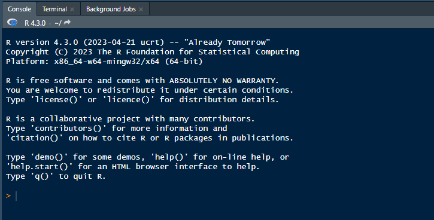
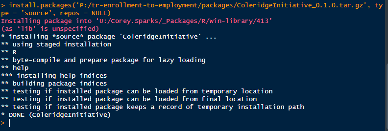
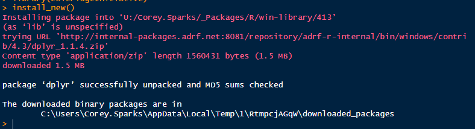

## How to install `ColeridgeInitiative` R package

We have written a R package to help users install fundamental packages needed for ADA and short course trainings. The package is called `ColeridgeInitiative` and can be installed from within RStudio.

You only have to install the package once and the functions will be available each time you use RStudio.

To install the package, at the Console in RStudio

Type the following:

`install.packages('P:/tr-state-impact-ada-training/r_packages/ColeridgeInitiative_0.1.2.zip')`

The package will install and when it is finished , you should see a result similar to this:

**NOTE** Some users have to run the `install.packages()` script more than once to get the package to install correctly. If you receive an error, just re-run the script.

To use the package, at the console, or in an R script, type

`library(ColeridgeInitiative)`

### Installing basic packages

To install the basic packages needed for the course, run the following command in the console:

`install_new()`

This will take a minute or so, but when it is done, you should see the prompt returned to you

Now you can use the packages as you would normally use them. For example. to load the `dplyr` package, simply type (at the console, or in a script)

`library(dplyr)`

And the functions in that package will be available to you.

### Getting help

If this does not work for you, I recommend reaching out to your team lead or to the slack channel for your course.
